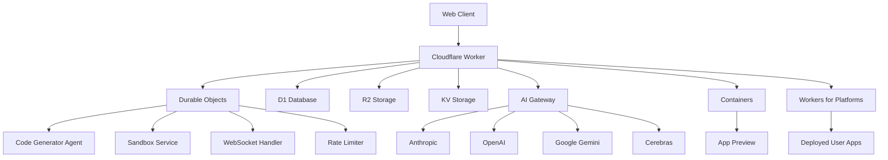
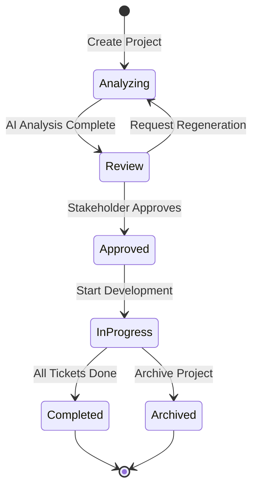
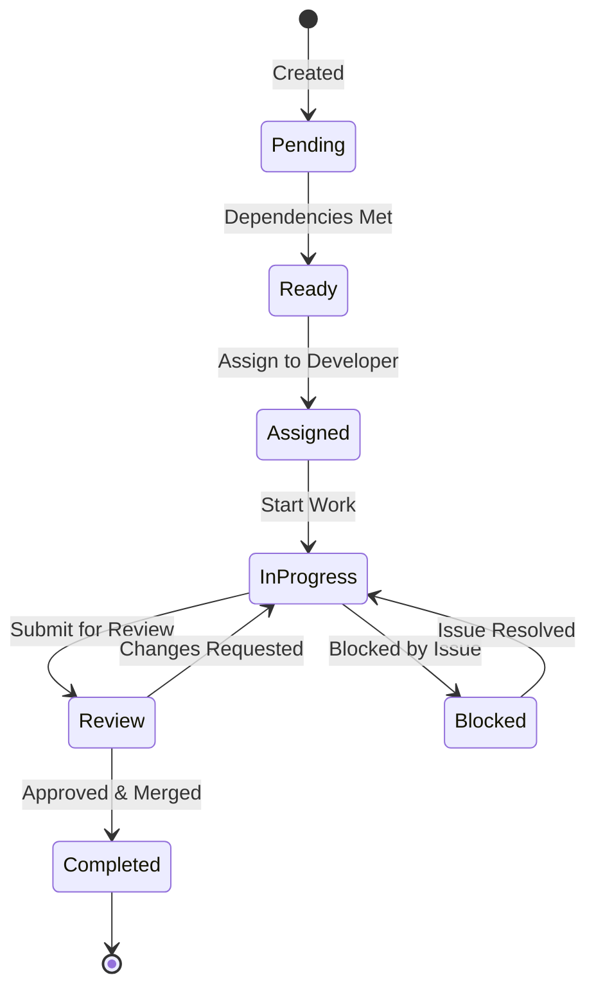

# Byte Platform - Technical Specification

**Version:** 1.0.0  
**Last Updated:** October 2025  
**Status:** Production

---

## Table of Contents

1. [System Overview](#system-overview)
2. [Architecture](#architecture)
3. [Database Schema](#database-schema)
4. [API Reference](#api-reference)
5. [Authentication & Authorization](#authentication--authorization)
6. [Orchestrator System](#orchestrator-system)
7. [WebSocket Protocol](#websocket-protocol)
8. [AI Integration](#ai-integration)
9. [Deployment Architecture](#deployment-architecture)
10. [Security](#security)
11. [Performance & Scalability](#performance--scalability)

---

## System Overview

Byte Platform is a full-stack AI-powered application generator built on Cloudflare's developer platform. It enables users to create web applications using natural language, leveraging AI for code generation, real-time previews, and one-click deployment.

### Key Components

- **Frontend**: React + Vite + TypeScript + Tailwind CSS
- **Backend**: Cloudflare Workers (Hono framework)
- **Database**: Cloudflare D1 (SQLite)
- **AI**: Multi-provider support (Anthropic, OpenAI, Google Gemini, Cerebras, Cloudflare)
- **Storage**: R2 (templates), KV (sessions)
- **Containers**: Sandboxed app previews
- **Real-time**: WebSocket via Durable Objects
- **Deployment**: Workers for Platforms

### Technology Stack

```
Frontend:
├── React 19.1.1
├── TypeScript 5.9.2
├── Tailwind CSS 4.1.13
├── Vite 7.1.13
├── React Router 7.9.3
└── Monaco Editor (code editing)

Backend:
├── Hono 4.9.9 (Web framework)
├── Cloudflare Workers
├── Durable Objects (stateful services)
├── D1 Database (SQLite)
└── Drizzle ORM 0.44.5

AI & ML:
├── Anthropic Claude (via AI Gateway)
├── OpenAI GPT (via AI Gateway)
├── Google Gemini
├── Cerebras
└── Cloudflare Workers AI

Infrastructure:
├── Cloudflare Workers for Platforms
├── Cloudflare Containers
├── R2 Object Storage
├── KV Storage
└── AI Gateway
```

---

## Architecture

### High-Level Architecture



### Request Flow

1. **User Request** → Cloudflare Edge
2. **Authentication** → JWT validation (optional OAuth)
3. **Rate Limiting** → Durable Object rate limit check
4. **Routing** → Hono router dispatches to controller
5. **Business Logic** → Service layer processes request
6. **Data Access** → Drizzle ORM queries D1 database
7. **AI Operations** → AI Gateway routes to provider
8. **Response** → JSON/streaming response to client

### Durable Objects

#### 1. CodeGeneratorAgent
- **Purpose**: Stateful AI code generation
- **Lifecycle**: Per-app instance
- **State**: Generation history, phase tracking, file system
- **Operations**: 
  - Code generation in phases
  - Error detection & correction
  - Real-time progress streaming

#### 2. UserAppSandboxService
- **Purpose**: Sandboxed app execution
- **Lifecycle**: Per-app instance
- **State**: Running container, file system, terminal state
- **Operations**:
  - Container lifecycle management
  - File operations
  - Terminal command execution
  - Hot reload

#### 3. OrchestratorWebSocket
- **Purpose**: Real-time project updates
- **Lifecycle**: Global singleton
- **State**: Active connections, subscriptions
- **Operations**:
  - WebSocket connection management
  - Event broadcasting
  - Heartbeat monitoring

#### 4. DORateLimitStore
- **Purpose**: Distributed rate limiting
- **Lifecycle**: Global singleton
- **State**: Request counts per user/IP
- **Operations**:
  - Request counting
  - Limit enforcement
  - Automatic reset

---

## Database Schema

### Core Tables

#### apps
```sql
CREATE TABLE apps (
    id TEXT PRIMARY KEY,
    user_id TEXT REFERENCES users(id),
    title TEXT NOT NULL,
    description TEXT,
    visibility TEXT CHECK (visibility IN ('public', 'private')),
    config TEXT, -- JSON: model config, settings
    tags TEXT, -- JSON array
    files TEXT, -- JSON: file tree
    container_state TEXT, -- JSON: terminal, preview state
    is_deployed BOOLEAN DEFAULT 0,
    deploy_url TEXT,
    created_at INTEGER DEFAULT (unixepoch()),
    updated_at INTEGER DEFAULT (unixepoch())
);
```

#### users
```sql
CREATE TABLE users (
    id TEXT PRIMARY KEY,
    email TEXT UNIQUE NOT NULL,
    display_name TEXT,
    avatar_url TEXT,
    provider TEXT, -- 'google' | 'github'
    provider_user_id TEXT,
    created_at INTEGER DEFAULT (unixepoch()),
    last_login INTEGER
);
```

### Orchestration Tables

#### orchestration_projects
```sql
CREATE TABLE orchestration_projects (
    id TEXT PRIMARY KEY,
    app_id TEXT REFERENCES apps(id),
    title TEXT NOT NULL,
    description TEXT,
    status TEXT CHECK (status IN (
        'analyzing', 'review', 'approved', 
        'in_progress', 'completed', 'archived'
    )),
    github_repo_url TEXT,
    github_repo_name TEXT,
    github_default_branch TEXT DEFAULT 'main',
    stakeholder_user_id TEXT REFERENCES users(id),
    analysis_result TEXT, -- JSON
    total_tickets INTEGER DEFAULT 0,
    completed_tickets INTEGER DEFAULT 0,
    created_at INTEGER DEFAULT (unixepoch()),
    analyzed_at INTEGER,
    approved_at INTEGER,
    completed_at INTEGER
);
```

#### orchestration_tickets
```sql
CREATE TABLE orchestration_tickets (
    id TEXT PRIMARY KEY,
    project_id TEXT REFERENCES orchestration_projects(id),
    title TEXT NOT NULL,
    description TEXT NOT NULL,
    type TEXT CHECK (type IN (
        'feature', 'enhancement', 'bug', 
        'refactor', 'test', 'documentation', 'setup'
    )),
    priority TEXT CHECK (priority IN (
        'critical', 'high', 'medium', 'low'
    )),
    status TEXT CHECK (status IN (
        'pending', 'ready', 'assigned', 'in_progress',
        'review', 'blocked', 'completed', 'cancelled'
    )),
    order_index INTEGER NOT NULL,
    category TEXT,
    tags TEXT, -- JSON array
    branch_name TEXT,
    pr_url TEXT,
    commit_count INTEGER DEFAULT 0,
    estimated_hours INTEGER,
    actual_hours INTEGER,
    affected_files TEXT, -- JSON
    acceptance_criteria TEXT, -- JSON
    created_at INTEGER DEFAULT (unixepoch()),
    updated_at INTEGER DEFAULT (unixepoch()),
    started_at INTEGER,
    completed_at INTEGER
);
```

#### orchestration_ticket_dependencies
```sql
CREATE TABLE orchestration_ticket_dependencies (
    id TEXT PRIMARY KEY,
    ticket_id TEXT REFERENCES orchestration_tickets(id),
    depends_on_ticket_id TEXT REFERENCES orchestration_tickets(id),
    dependency_type TEXT CHECK (dependency_type IN (
        'blocks', 'related', 'file_conflict'
    )),
    created_at INTEGER DEFAULT (unixepoch()),
    UNIQUE(ticket_id, depends_on_ticket_id),
    CHECK(ticket_id != depends_on_ticket_id)
);
```

### Indexes

```sql
-- App indexes
CREATE INDEX idx_apps_user ON apps(user_id);
CREATE INDEX idx_apps_visibility ON apps(visibility);
CREATE INDEX idx_apps_deployed ON apps(is_deployed);

-- Project indexes
CREATE INDEX idx_projects_status ON orchestration_projects(status);
CREATE INDEX idx_projects_stakeholder ON orchestration_projects(stakeholder_user_id);

-- Ticket indexes
CREATE INDEX idx_tickets_project ON orchestration_tickets(project_id);
CREATE INDEX idx_tickets_status ON orchestration_tickets(status);
CREATE INDEX idx_tickets_priority ON orchestration_tickets(priority);
CREATE INDEX idx_tickets_order ON orchestration_tickets(project_id, order_index);
```

---

## API Reference

### Base URL
- **Production**: `https://your-worker-name.workers.dev/api`
- **Development**: `http://localhost:5173/api`

### Authentication

All authenticated endpoints require JWT token in header:
```
Authorization: Bearer <jwt_token>
```

### Apps API

#### List Apps
```http
GET /apps
Query Parameters:
  - search: string (optional)
  - sort: 'date' | 'name' | 'updated' (optional)
  - visibility: 'public' | 'private' | 'all' (optional)
  - page: number (optional, default: 1)
  - limit: number (optional, default: 20)

Response: 200 OK
{
  "apps": [
    {
      "id": "app-123",
      "title": "Todo App",
      "description": "A simple todo list",
      "visibility": "public",
      "createdAt": "2025-10-14T11:00:00Z",
      "updatedAt": "2025-10-14T11:30:00Z"
    }
  ],
  "total": 1,
  "page": 1,
  "totalPages": 1
}
```

#### Get App
```http
GET /apps/:id

Response: 200 OK
{
  "id": "app-123",
  "title": "Todo App",
  "description": "A simple todo list",
  "files": { ... },
  "config": { ... }
}
```

#### Create App
```http
POST /apps
Content-Type: application/json

{
  "title": "My New App",
  "description": "App description",
  "visibility": "private"
}

Response: 201 Created
{
  "id": "app-456",
  "title": "My New App"
}
```

#### Update App
```http
PATCH /apps/:id
Content-Type: application/json

{
  "title": "Updated Title",
  "description": "Updated description"
}

Response: 200 OK
```

#### Delete App
```http
DELETE /apps/:id

Response: 204 No Content
```

### Orchestrator API

#### List Projects
```http
GET /orchestrator/projects
Query Parameters:
  - status: ProjectStatus (optional)
  - search: string (optional)

Response: 200 OK
{
  "projects": [
    {
      "id": "proj-123",
      "title": "E-commerce Platform",
      "status": "in_progress",
      "totalTickets": 15,
      "completedTickets": 8
    }
  ]
}
```

#### Create Project
```http
POST /orchestrator/projects
Content-Type: application/json

{
  "source": "app",  // 'app' | 'github' | 'new'
  "appId": "app-123",
  "title": "Optional Custom Title"
}

Response: 201 Created
{
  "project": {
    "id": "proj-456",
    "title": "E-commerce Platform",
    "status": "analyzing"
  },
  "message": "Project created successfully"
}
```

#### Get Project
```http
GET /orchestrator/projects/:id

Response: 200 OK
{
  "id": "proj-123",
  "title": "E-commerce Platform",
  "status": "in_progress",
  "tickets": [
    {
      "id": "ticket-789",
      "title": "Implement user authentication",
      "type": "feature",
      "priority": "high",
      "status": "in_progress"
    }
  ]
}
```

#### Generate Tickets
```http
POST /orchestrator/projects/:id/generate

Response: 200 OK
{
  "message": "Ticket generation started",
  "projectId": "proj-123"
}
```

#### Update Project
```http
PATCH /orchestrator/projects/:id
Content-Type: application/json

{
  "action": "approve",  // 'approve' | 'regenerate' | 'archive'
  "guidance": "Focus on security best practices"
}

Response: 200 OK
```

#### List Tickets
```http
GET /orchestrator/tickets
Query Parameters:
  - projectId: string (optional)
  - status: TicketStatus[] (optional)
  - assignedToMe: boolean (optional)

Response: 200 OK
{
  "tickets": [ ... ]
}
```

#### Update Ticket
```http
PATCH /orchestrator/tickets/:id
Content-Type: application/json

{
  "status": "in_progress",
  "branchName": "feature/user-auth",
  "actualHours": 4
}

Response: 200 OK
```

#### Assign Ticket
```http
POST /orchestrator/tickets/:id/assign
Content-Type: application/json

{
  "userId": "user-123"  // optional, defaults to current user
}

Response: 200 OK
```

### GitHub Integration API

#### Create Repository
```http
POST /orchestrator/projects/:id/github/create-repo
Content-Type: application/json

{
  "name": "my-project",
  "description": "Project description",
  "private": true
}

Response: 201 Created
{
  "repoUrl": "https://github.com/user/my-project"
}
```

#### Create Branch
```http
POST /orchestrator/tickets/:id/github/create-branch

Response: 201 Created
{
  "branchName": "feature/user-auth"
}
```

#### Create Pull Request
```http
POST /orchestrator/tickets/:id/github/create-pr
Content-Type: application/json

{
  "title": "Implement user authentication",
  "body": "Adds JWT-based authentication"
}

Response: 201 Created
{
  "prUrl": "https://github.com/user/repo/pull/1"
}
```

### Agent API

#### Start Chat
```http
POST /agent/chat/:appId
Content-Type: application/json

{
  "message": "Create a todo list with dark mode",
  "config": {
    "model": "claude-sonnet-4.5",
    "temperature": 0.7
  }
}

Response: 200 OK (Server-Sent Events)
event: phase_start
data: {"phase": "planning", "message": "Analyzing requirements"}

event: file_generated
data: {"path": "src/App.tsx", "content": "..."}

event: phase_complete
data: {"phase": "planning", "message": "Blueprint created"}
```

---

## Authentication & Authorization

### OAuth Providers

#### Google OAuth
```typescript
// Configuration
GOOGLE_CLIENT_ID="..."
GOOGLE_CLIENT_SECRET="..."

// Flow
1. User clicks "Sign in with Google"
2. Redirect to Google OAuth consent
3. Google redirects to /api/auth/callback/google
4. Backend exchanges code for user info
5. JWT token issued
```

#### GitHub OAuth
```typescript
// Configuration
GITHUB_CLIENT_ID="..."
GITHUB_CLIENT_SECRET="..."

// Flow
1. User clicks "Sign in with GitHub"
2. Redirect to GitHub OAuth consent
3. GitHub redirects to /api/auth/callback/github
4. Backend exchanges code for user info
5. JWT token issued
```

### JWT Structure

```typescript
interface JWTPayload {
  userId: string;
  email: string;
  displayName: string;
  provider: 'google' | 'github';
  iat: number;  // Issued at
  exp: number;  // Expires at (30 days)
}
```

### Authorization Levels

```typescript
enum AuthLevel {
  Public,        // No authentication required
  Authenticated, // Valid JWT required
  Admin          // Admin user required
}
```

### Protected Routes

```typescript
// Middleware stack
Request → CORS → Rate Limit → Auth → Controller

// Example
router.get('/apps',
  setAuthLevel(AuthConfig.authenticated),
  adaptController(AppsController, AppsController.listApps)
);
```

---

## Orchestrator System

### Project Lifecycle



### Ticket Lifecycle



### AI Ticket Generation

```typescript
// Analysis Process
1. Analyze app structure
   - Parse file tree
   - Identify tech stack
   - Extract dependencies
   
2. Identify features
   - Component analysis
   - Route mapping
   - API endpoint detection
   
3. Generate tickets
   - Break down features
   - Assign priorities
   - Estimate effort
   - Define dependencies
   
4. Create development plan
   - Logical ordering
   - Parallel work streams
   - Critical path analysis
```

### Ticket Dependencies

```typescript
// Dependency Types
enum DependencyType {
  BLOCKS,        // Must complete before starting
  RELATED,       // Loosely related
  FILE_CONFLICT  // Works on same files
}

// Example
{
  ticketId: "ticket-1",
  dependsOnTicketId: "ticket-2",
  dependencyType: "blocks"
}
```

---

## WebSocket Protocol

### Connection Flow

```typescript
// 1. Client connects
const ws = new WebSocket('wss://api.example.com/orchestrator/ws');

// 2. Authenticate
ws.send(JSON.stringify({
  type: 'authenticate',
  token: 'jwt_token_here',
  clientType: 'web',
  projectId: 'proj-123'
}));

// 3. Receive auth confirmation
{
  type: 'auth_success',
  userId: 'user-123',
  connectionId: 'conn-456',
  subscriptions: ['proj-123']
}

// 4. Subscribe to projects
ws.send(JSON.stringify({
  type: 'subscribe',
  projectId: 'proj-789'
}));

// 5. Receive updates
{
  type: 'ticket_updated',
  projectId: 'proj-123',
  ticketId: 'ticket-456',
  changes: [...]
}
```

### Message Types

#### Client → Server

```typescript
// Authenticate
{
  type: 'authenticate',
  token: string,
  clientType: 'web' | 'vscode',
  projectId?: string
}

// Subscribe
{
  type: 'subscribe',
  projectId: string
}

// Unsubscribe
{
  type: 'unsubscribe',
  projectId: string
}

// Heartbeat response
{
  type: 'pong',
  timestamp: string
}
```

#### Server → Client

```typescript
// Auth success
{
  type: 'auth_success',
  userId: string,
  connectionId: string,
  subscriptions: string[]
}

// Ticket updated
{
  type: 'ticket_updated',
  projectId: string,
  ticketId: string,
  changes: Array<{
    field: string,
    oldValue: any,
    newValue: any
  }>
}

// Status changed
{
  type: 'ticket_status_changed',
  projectId: string,
  ticketId: string,
  oldStatus: TicketStatus,
  newStatus: TicketStatus
}

// Heartbeat
{
  type: 'heartbeat',
  timestamp: string
}

// Error
{
  type: 'error',
  error: string,
  message: string,
  recoverable: boolean
}
```

### Heartbeat Mechanism

```typescript
// Server sends heartbeat every 30 seconds
setInterval(() => {
  ws.send({ type: 'heartbeat' });
}, 30000);

// Client must respond within 60 seconds
client.on('heartbeat', () => {
  ws.send({ type: 'pong', timestamp: Date.now() });
});

// Connection expires if no heartbeat for 120 seconds
```

---

## AI Integration

### AI Gateway Configuration

```typescript
// Gateway setup
{
  gatewayId: "byte-platform-gateway",
  providers: [
    "anthropic",
    "openai", 
    "google-ai-studio",
    "cerebras",
    "cloudflare-workers-ai"
  ],
  authentication: "token",
  rateLimits: {
    requestsPerMinute: 100,
    tokensPerMinute: 100000
  }
}
```

### Model Configuration

```typescript
interface ModelConfig {
  provider: 'anthropic' | 'openai' | 'google' | 'cerebras' | 'cloudflare';
  model: string;
  temperature: number;        // 0.0 - 1.0
  maxTokens: number;
  topP?: number;
  frequencyPenalty?: number;
  presencePenalty?: number;
}

// Example
{
  provider: "anthropic",
  model: "claude-sonnet-4.5",
  temperature: 0.7,
  maxTokens: 8000
}
```

### Code Generation Pipeline

```typescript
// Phase 1: Planning
- Analyze user requirements
- Create file structure blueprint
- Define component hierarchy

// Phase 2: Foundation
- Generate package.json
- Create configuration files
- Setup project scaffolding

// Phase 3: Core Implementation
- Generate main components
- Implement business logic
- Create utility functions

// Phase 4: Styling
- Add CSS/Tailwind styles
- Implement responsive design
- Create theme system

// Phase 5: Integration
- Connect API endpoints
- Add state management
- Implement routing

// Phase 6: Optimization
- Error correction
- Performance optimization
- Code cleanup
```

### Error Correction

```typescript
// Automated error detection
1. Lint generated code (ESLint)
2. Type checking (TypeScript)
3. Parse errors (Babel)
4. Runtime errors (from container)

// Correction process
if (hasErrors) {
  const correction = await ai.generateCorrection({
    originalCode,
    errors,
    context
  });
  
  applyCorrection(correction);
}
```

---

## Deployment Architecture

### Workers for Platforms

```typescript
// Dispatch namespace configuration
{
  namespace: "byte-platform-namespace",
  workers: [
    {
      id: "app-123",
      scriptName: "user-app-123",
      routes: ["*.app-123.build.cloudflare.dev/*"]
    }
  ]
}

// Dynamic routing
export default {
  async fetch(request, env) {
    const appId = extractAppId(request);
    const worker = env.DISPATCHER.get(appId);
    return await worker.fetch(request);
  }
}
```

### Container Configuration

```typescript
// Sandbox instance types
{
  "lite": {
    memory: "256 MiB",
    cpu: "1/16 vCPU",
    disk: "2 GB"
  },
  "standard-1": {
    memory: "4 GiB",
    cpu: "1/2 vCPU",
    disk: "8 GB"
  },
  "standard-3": {
    memory: "12 GiB",
    cpu: "2 vCPU",
    disk: "16 GB"
  },
  "standard-4": {
    memory: "12 GiB",
    cpu: "4 vCPU",
    disk: "20 GB"
  }
}
```

### Resource Limits

```typescript
// Per-user limits
{
  maxApps: 100,
  maxSandboxInstances: 10,
  maxStoragePerApp: 100 * 1024 * 1024, // 100 MB
  maxProjectsActive: 5
}

// Rate limits
{
  apiRequestsPerMinute: 100,
  aiRequestsPerMinute: 20,
  deploymentPerHour: 10
}
```

---

## Security

### Input Validation

```typescript
// Request validation using Zod
const CreateProjectSchema = z.object({
  source: z.enum(['app', 'github', 'new']),
  appId: z.string().optional(),
  title: z.string().max(200).optional(),
  githubRepoUrl: z.string().url().optional(),
  description: z.string().max(1000).optional()
});

// Usage
const validated = CreateProjectSchema.parse(request.body);
```

### Content Security Policy

```typescript
// CSP headers
{
  "Content-Security-Policy": 
    "default-src 'self'; " +
    "script-src 'self' 'unsafe-inline' 'unsafe-eval'; " +
    "style-src 'self' 'unsafe-inline'; " +
    "img-src 'self' data: https:; " +
    "connect-src 'self' wss: https:;"
}
```

### Secret Management

```typescript
// Secrets stored in Workers secrets
- JWT_SECRET
- GOOGLE_CLIENT_SECRET
- GITHUB_CLIENT_SECRET
- ANTHROPIC_API_KEY
- OPENAI_API_KEY
- WEBHOOK_SECRET

// Encrypted storage for user secrets
import { encryptSecret, decryptSecret } from '@/crypto';

const encrypted = encryptSecret(apiKey, SECRETS_ENCRYPTION_KEY);
await db.insert(secrets).values({ encrypted });
```

### Sandbox Isolation

```typescript
// Container security
{
  networkIsolation: true,
  readOnlyFileSystem: false,
  noNewPrivileges: true,
  resourceLimits: {
    memory: "12 GiB",
    cpu: "2 vCPU",
    disk: "16 GB"
  },
  timeout: 300000 // 5 minutes
}
```

---

## Performance & Scalability

### Caching Strategy

```typescript
// KV caching
{
  userSessions: 3600,        // 1 hour
  appMetadata: 300,          // 5 minutes
  publicApps: 60,            // 1 minute
  templates: 86400           // 24 hours
}

// D1 read replicas
{
  enableReadReplicas: true,
  replicationLag: "< 10ms"
}
```

### Database Optimization

```typescript
// Indexed queries
CREATE INDEX idx_apps_user_visibility 
ON apps(user_id, visibility);

CREATE INDEX idx_tickets_project_status 
ON orchestration_tickets(project_id, status);

// Query optimization
- Use prepared statements
- Batch operations where possible
- Limit result sets
- Use pagination
```

### Monitoring

```typescript
// Cloudflare Analytics
- Request rate
- Error rate
- Response time (p50, p95, p99)
- AI Gateway usage
- Container resource usage

// Custom metrics
- Active users
- Apps created per day
- Deployment success rate
- Average generation time
```

### Load Distribution

```typescript
// Global edge network
- 330+ cities worldwide
- Automatic load balancing
- Regional failover
- DDoS protection

// Durable Objects
- Automatic placement near users
- Consistent hashing for distribution
- Hibernation for idle objects
```

---

## Appendix

### Environment Variables

```bash
# Required
JWT_SECRET=
WEBHOOK_SECRET=
SECRETS_ENCRYPTION_KEY=
GOOGLE_AI_STUDIO_API_KEY=
CUSTOM_DOMAIN=
ALLOWED_EMAIL=

# Optional - AI Providers
ANTHROPIC_API_KEY=
OPENAI_API_KEY=
CEREBRAS_API_KEY=

# Optional - OAuth
GOOGLE_CLIENT_ID=
GOOGLE_CLIENT_SECRET=
GITHUB_CLIENT_ID=
GITHUB_CLIENT_SECRET=

# Optional - GitHub Export
GITHUB_EXPORTER_CLIENT_ID=
GITHUB_EXPORTER_CLIENT_SECRET=

# Configuration
CLOUDFLARE_AI_GATEWAY=byte-platform-gateway
DISPATCH_NAMESPACE=byte-platform-namespace
SANDBOX_INSTANCE_TYPE=standard-3
MAX_SANDBOX_INSTANCES=10
ENABLE_READ_REPLICAS=true
```

### Error Codes

```typescript
// HTTP Status Codes
200 - Success
201 - Created
204 - No Content
400 - Bad Request
401 - Unauthorized
403 - Forbidden
404 - Not Found
429 - Too Many Requests
500 - Internal Server Error
503 - Service Unavailable

// Custom Error Codes
E001 - Invalid authentication token
E002 - Resource not found
E003 - Rate limit exceeded
E004 - Validation error
E005 - AI generation failed
E006 - Container startup failed
E007 - Deployment failed
```

### API Rate Limits

```typescript
{
  authentication: {
    requests: 1000,
    window: "1m"
  },
  api: {
    requests: 10000,
    window: "1m"
  },
  ai: {
    requests: 20,
    window: "1m",
    tokens: 100000
  }
}
```

---

**Document Version**: 1.0.0  
**Last Updated**: October 14, 2025  
**Maintainer**: Byte Platform Team