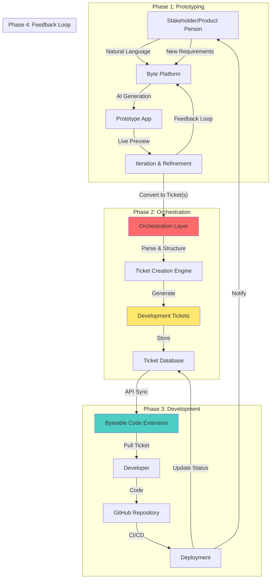
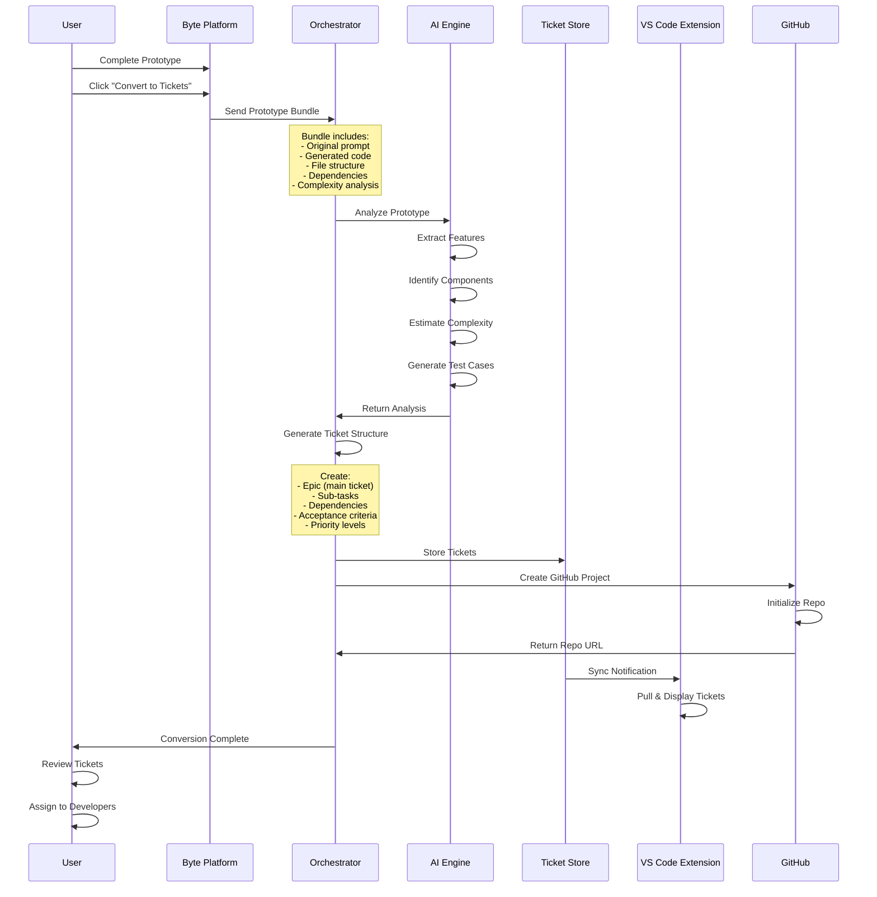
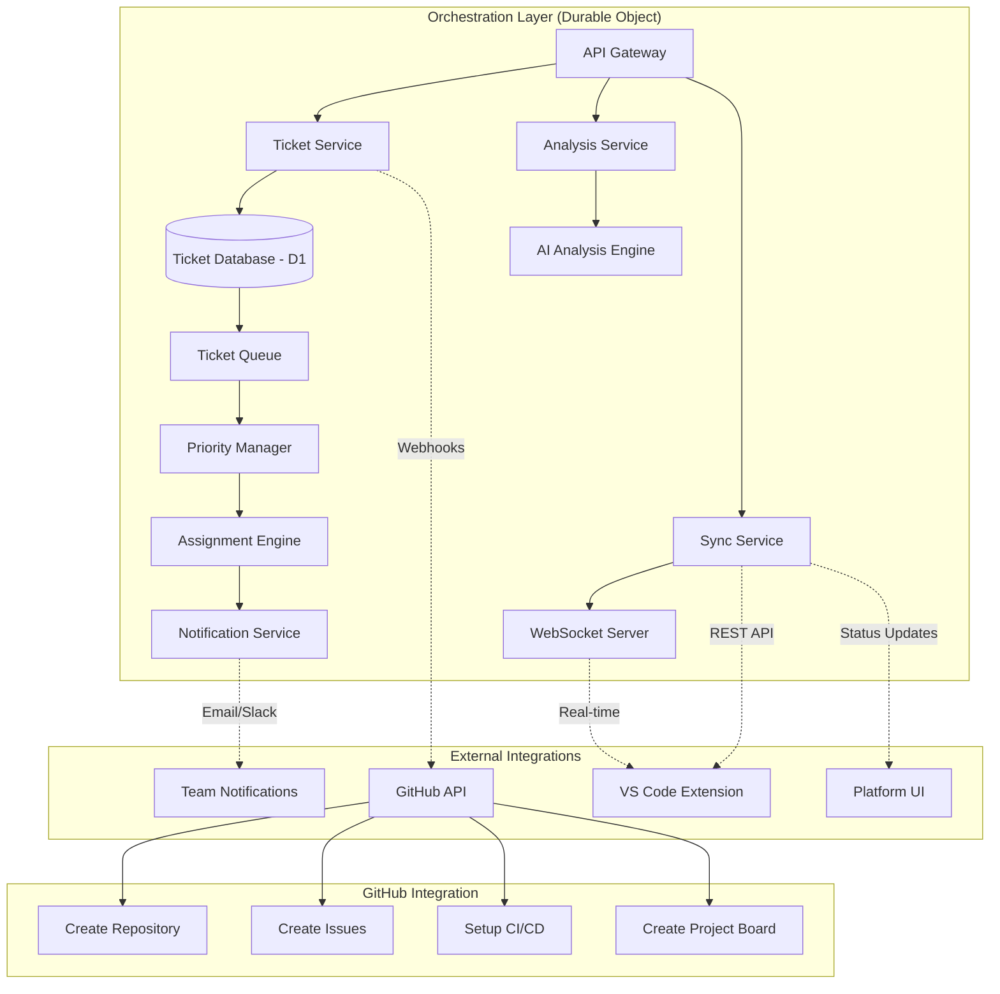
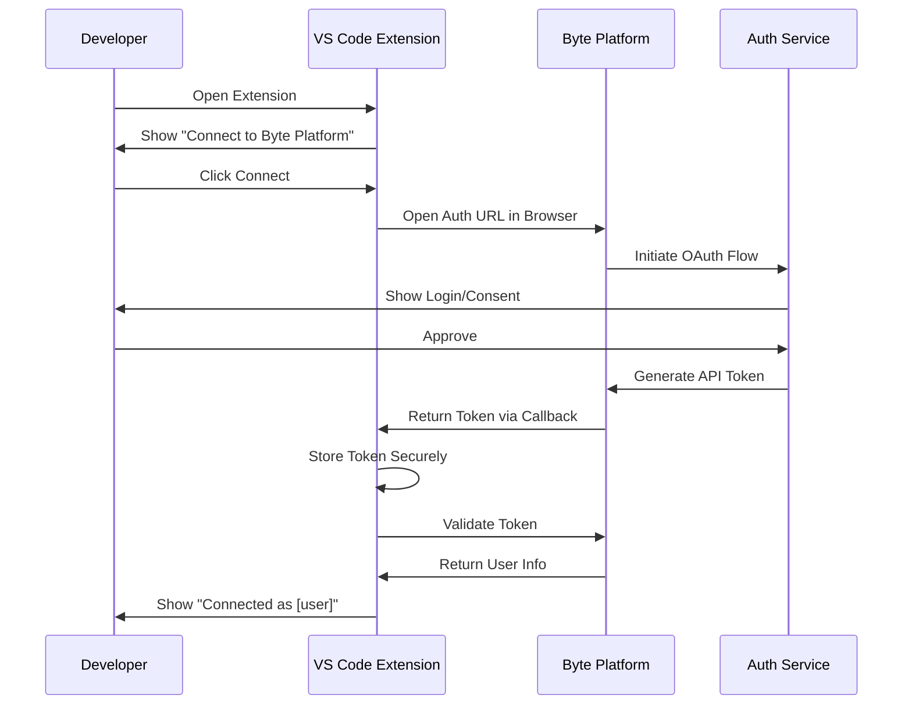
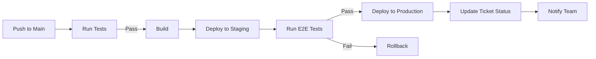
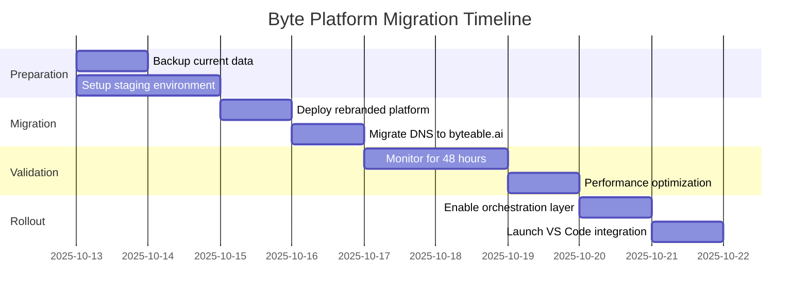

# Byte Platform Rebranding & Workflow Strategy
## Strategic Transformation Plan

**Version:** 1.0  
**Date:** October 12, 2025  
**Domain:** byteable.ai (unified marketing & platform)  
**Status:** Strategic Planning Phase

---

## Executive Summary

This document outlines the comprehensive strategic plan to transform the Cloudflare VibeSdk into a branded "Byte" platform. The Byte platform introduces a revolutionary workflow that bridges the gap between rapid prototyping and professional software development.

### Vision

**Byte Platform** enables stakeholders and product people to rapidly prototype applications using natural language, which are then automatically converted into structured tickets within an orchestration layer. Developers using the Byteable Code VS Code extension can pull these tickets and develop production-ready solutions while maintaining the infrastructure benefits of Cloudflare's platform.

### Key Transformation Goals

1. **Complete Rebranding** - Remove all Cloudflare product branding while maintaining infrastructure
2. **Orchestration Layer** - Build a sophisticated system to convert prototypes into developer tickets
3. **VS Code Integration** - Seamless connection between tickets and Byteable Code extension
4. **GitHub Workflow** - Automated repository management and CI/CD
5. **Infrastructure Continuity** - Leverage existing Cloudflare stack without vendor lock-in

### Success Metrics

- Zero Cloudflare product references in user-facing materials
- <100ms ticket synchronization between platform and VS Code extension
- 90% prototype-to-ticket conversion success rate
- Complete developer workflow from ticket assignment to deployment

---

## Table of Contents

1. [Rebranding Strategy](#1-rebranding-strategy)
2. [Workflow Architecture](#2-workflow-architecture)
3. [Technical Implementation Plan](#3-technical-implementation-plan)
4. [Integration Specifications](#4-integration-specifications)
5. [Deployment Strategy](#5-deployment-strategy)
6. [Risk Assessment & Mitigation](#6-risk-assessment--mitigation)
7. [Success Criteria & KPIs](#7-success-criteria--kpis)

---

## 1. Rebranding Strategy

### 1.1 Inventory of Cloudflare References

#### Critical User-Facing Items to Rebrand

**Frontend Components**
- [ ] [`README.md`](../README.md) - All occurrences of "Cloudflare VibeSDK" → "Byte Platform"
- [ ] [`src/components/layout/global-header.tsx`](../src/components/layout/global-header.tsx:92-96) - Deploy button text and links
- [ ] Product name in page titles, meta descriptions
- [ ] Error messages and user notifications
- [ ] Email templates (if any)

**Configuration & Setup**
- [ ] [`package.json`](../package.json:2) - `name: "vibesdk"` → `name: "byte-platform"`
- [ ] [`wrangler.jsonc`](../wrangler.jsonc:7) - `name: "vibesdk-production"` → `name: "byte-platform-production"`
- [ ] [`worker-configuration.d.ts`](../worker-configuration.d.ts:6) - Template repository references
- [ ] Database names (`vibesdk-db` → `byte-platform-db`)
- [ ] KV namespace names (`VibecoderStore` → `BytePlatformStore`)
- [ ] R2 bucket names (`vibesdk-templates` → `byte-templates`)

**Code References (Internal)**
- [ ] [`worker/agents/operations/UserConversationProcessor.ts`](../worker/agents/operations/UserConversationProcessor.ts:52) - AI system prompts
- [ ] [`worker/agents/prompts.ts`](../worker/agents/prompts.ts:1018) - Generation instructions
- [ ] [`worker/services/github/GitHubService.ts`](../worker/services/github/GitHubService.ts:42-44) - Bot name and email
- [ ] Logger names and identifiers
- [ ] Error tracking identifiers

**Documentation**
- [ ] All `.md` files in [`docs/`](../docs/) directory
- [ ] [`CLAUDE.md`](../CLAUDE.md:3) - Developer guidance
- [ ] Setup and deployment guides
- [ ] API documentation

#### Items to Keep (Infrastructure Level)

These Cloudflare platform services remain unchanged (infrastructure, not branding):
- Cloudflare Workers runtime
- D1 Database engine
- Durable Objects
- R2 Storage
- KV Storage
- Containers (Sandbox)
- AI Gateway (internal)
- Workers for Platforms (Dispatch)

### 1.2 New "Byte" Brand Identity

#### Unified Domain Strategy (byteable.ai)

```
byteable.ai Architecture:
├── / (root)                    → Marketing site + Platform login
├── /platform                   → Platform application (authenticated)
├── /docs                       → Documentation
├── /blog                       → Blog/updates
├── /api                        → API endpoints for VS Code extension
│   ├── /v1/tickets             → Ticket management API
│   ├── /v1/sync                → Real-time synchronization
│   └── /v1/projects            → Project management
├── /orchestrator               → Orchestration layer API (internal)
└── *.preview.byteable.ai       → Preview applications (subdomains)
```

#### Brand Assets Needed

```
byte-platform/
├── public/
│   ├── brand/
│   │   ├── logo.svg                    # Primary logo
│   │   ├── logo-dark.svg               # Dark mode variant
│   │   ├── icon.svg                    # Favicon/icon
│   │   ├── wordmark.svg                # Text logo
│   │   └── og-image.png                # Social media preview
│   ├── marketing/
│   │   ├── hero-illustration.svg       # Landing page hero
│   │   ├── workflow-diagram.svg        # Workflow visualization
│   │   ├── feature-*.png               # Feature screenshots
│   │   └── testimonial-logos/          # Customer logos
│   └── docs/
│       └── architecture-diagrams/      # Technical diagrams
```

#### Brand Voice & Messaging

**Before (VibeSdk):**
- "Cloudflare's AI vibe coding platform"
- "Deploy to Cloudflare Workers"
- Heavy emphasis on Cloudflare infrastructure

**After (Byte Platform):**
- **Tagline:** "From Prototype to Production, Instantly"
- **Mission:** "Bridge the gap between product vision and developer execution"
- **Value Props:**
  - "Prototype with AI, develop with confidence"
  - "Natural language requirements → Structured development tickets"
  - "Seamless handoff from stakeholders to developers"

### 1.3 Naming Conventions

#### File & Folder Naming

```javascript
// OLD
vibesdk-production
vibesdk-db
vibesdk-gateway
vibesdk-templates
VibecoderStore

// NEW
byte-platform-production
byte-platform-db
byte-ai-gateway
byte-templates
BytePlatformStore
```

#### Variable Naming Convention

```typescript
// Pattern: Use "byte" prefix for platform-specific identifiers
// Keep generic names for common patterns

// Configuration
export const BYTE_PLATFORM_CONFIG = { ... };
export const BYTE_API_VERSION = "v1";
export const BYTE_ORCHESTRATION_NAMESPACE = "byte-orchestrator";

// Services
class BytePlatformService { }
class ByteOrchestrator { }
class ByteTicketManager { }

// Keep generic where appropriate
class AppService { }
class UserService { }
class AuthService { }
```

### 1.4 Configuration Changes Required

#### Environment Variables

```bash
# Replace in .dev.vars and .prod.vars
OLD: TEMPLATES_REPOSITORY=https://github.com/cloudflare/vibesdk-templates
NEW: TEMPLATES_REPOSITORY=https://github.com/byteable/byte-templates

OLD: CLOUDFLARE_AI_GATEWAY=vibesdk-gateway
NEW: BYTE_AI_GATEWAY=byte-ai-gateway

OLD: DISPATCH_NAMESPACE=vibesdk-default-namespace
NEW: BYTE_ORCHESTRATION_NAMESPACE=byte-orchestration

OLD: CUSTOM_DOMAIN=build.cloudflare.dev
NEW: CUSTOM_DOMAIN=byteable.ai

# New orchestration variables
BYTE_ORCHESTRATOR_ENABLED=true
BYTE_TICKET_SYNC_INTERVAL=5000
BYTE_VSCODE_API_KEY=<generated>
```

#### Domain Configuration

```yaml
Primary Domain: byteable.ai
  - Marketing: byteable.ai/
  - Platform: byteable.ai/platform
  - Docs: byteable.ai/docs
  - API: byteable.ai/api/v1
  - Orchestrator: byteable.ai/orchestrator (internal)
  - Preview Apps: *.preview.byteable.ai
  - Status: byteable.ai/status
```

---

## 2. Workflow Architecture

### 2.1 End-to-End Workflow Design



### 2.2 Prototype to Orchestration Conversion

#### Conversion Trigger Points

1. **Manual Trigger** - User clicks "Convert to Tickets" button in platform
2. **Automatic Trigger** - After successful prototype completion (configurable)
3. **Scheduled Trigger** - Batch processing of completed prototypes
4. **API Trigger** - External systems can request conversion via API

#### Conversion Process Flow



#### Ticket Generation Logic

```typescript
interface PrototypeAnalysis {
  prototypeId: string;
  originalPrompt: string;
  refinedPrompt: string;
  generatedFiles: FileMetadata[];
  dependencies: PackageDependency[];
  complexity: 'simple' | 'medium' | 'complex' | 'enterprise';
  estimatedHours: number;
  technicalStack: TechStack;
  features: ExtractedFeature[];
  components: ComponentAnalysis[];
}

interface TicketGenerationRules {
  // Complexity-based ticket splitting
  simple: {
    maxTickets: 3;
    avgPoints: 3;
    strategy: 'monolithic'; // Single epic, minimal sub-tasks
  };
  medium: {
    maxTickets: 8;
    avgPoints: 5;
    strategy: 'feature-based'; // Epic + feature tickets
  };
  complex: {
    maxTickets: 15;
    avgPoints: 8;
    strategy: 'component-based'; // Epic + feature + component tickets
  };
  enterprise: {
    maxTickets: 30;
    avgPoints: 13;
    strategy: 'layered'; // Epic + features + components + infrastructure
  };
}

interface GeneratedTicket {
  id: string;
  type: 'epic' | 'feature' | 'task' | 'bug' | 'infrastructure';
  title: string;
  description: string;
  prototypeReference: {
    id: string;
    files: string[];
    preview: string;
  };
  acceptanceCriteria: string[];
  technicalNotes: string[];
  dependencies: string[]; // Other ticket IDs
  estimatedPoints: number;
  priority: 'critical' | 'high' | 'medium' | 'low';
  labels: string[];
  assignee?: string;
  githubIssueUrl?: string;
}

// Core ticket generation algorithm
async function generateTickets(
  analysis: PrototypeAnalysis
): Promise<GeneratedTicket[]> {
  const tickets: GeneratedTicket[] = [];
  const rules = TICKET_GENERATION_RULES[analysis.complexity];
  
  // 1. Create main Epic ticket
  const epic = await createEpicTicket(analysis);
  tickets.push(epic);
  
  // 2. Generate feature tickets based on extracted features
  for (const feature of analysis.features) {
    const featureTicket = await createFeatureTicket(
      feature,
      epic.id,
      analysis
    );
    tickets.push(featureTicket);
    
    // 3. For complex features, break down into component tasks
    if (feature.complexity > rules.avgPoints) {
      const componentTasks = await breakdownFeature(
        feature,
        featureTicket.id,
        analysis
      );
      tickets.push(...componentTasks);
    }
  }
  
  // 4. Add infrastructure tickets if needed
  if (requiresInfrastructure(analysis)) {
    const infraTickets = await createInfrastructureTickets(
      epic.id,
      analysis
    );
    tickets.push(...infraTickets);
  }
  
  // 5. Generate test tickets
  const testTickets = await createTestTickets(epic.id, tickets, analysis);
  tickets.push(...testTickets);
  
  // 6. Establish dependencies between tickets
  establishDependencies(tickets);
  
  return tickets;
}

// Example ticket creation
function createEpicTicket(analysis: PrototypeAnalysis): GeneratedTicket {
  return {
    id: generateId('epic'),
    type: 'epic',
    title: `[Epic] ${analysis.originalPrompt}`,
    description: `
# Epic: ${analysis.originalPrompt}

## Overview
${analysis.refinedPrompt}

## Prototype Reference
- Prototype ID: ${analysis.prototypeId}
- Preview: ${getPreviewUrl(analysis.prototypeId)}
- Generated Files: ${analysis.generatedFiles.length}

## Technical Stack
${formatTechStack(analysis.technicalStack)}

## Estimated Effort
- Complexity: ${analysis.complexity}
- Estimated Hours: ${analysis.estimatedHours}
- Story Points: ${calculateStoryPoints(analysis)}

## Features to Implement
${analysis.features.map(f => `- ${f.name}`).join('\n')}

## Success Criteria
- All sub-tasks completed
- Code passes CI/CD pipeline
- Deployed to production
- Stakeholder approval
    `,
    acceptanceCriteria: [
      'All features from prototype implemented',
      'Code review approved',
      'Tests passing (>80% coverage)',
      'Documentation complete',
      'Deployed successfully',
    ],
    technicalNotes: generateTechnicalNotes(analysis),
    dependencies: [],
    estimatedPoints: calculateStoryPoints(analysis),
    priority: 'high',
    labels: ['epic', 'from-prototype', analysis.complexity],
  };
}
```

### 2.3 Orchestration Layer Architecture

#### Core Components



#### Database Schema for Orchestration

```sql
-- Tickets table (extends existing apps table)
CREATE TABLE tickets (
    id TEXT PRIMARY KEY,
    epic_id TEXT REFERENCES tickets(id),
    prototype_id TEXT NOT NULL REFERENCES apps(id),
    
    -- Ticket metadata
    type TEXT NOT NULL CHECK(type IN ('epic', 'feature', 'task', 'bug', 'infrastructure')),
    title TEXT NOT NULL,
    description TEXT NOT NULL,
    
    -- Status and workflow
    status TEXT NOT NULL DEFAULT 'todo' CHECK(status IN (
        'todo', 'in_progress', 'in_review', 'blocked', 'done', 'archived'
    )),
    priority TEXT NOT NULL CHECK(priority IN ('critical', 'high', 'medium', 'low')),
    
    -- Estimation and tracking
    estimated_points INTEGER,
    actual_hours REAL,
    
    -- Assignment
    assignee_id TEXT REFERENCES users(id),
    assigned_at INTEGER,
    
    -- Prototype reference
    prototype_files TEXT, -- JSON array of file paths
    prototype_preview_url TEXT,
    
    -- Acceptance criteria
    acceptance_criteria TEXT, -- JSON array
    technical_notes TEXT, -- JSON array
    
    -- GitHub integration
    github_repo_url TEXT,
    github_issue_number INTEGER,
    github_issue_url TEXT,
    github_project_url TEXT,
    
    -- Dependencies
    depends_on TEXT, -- JSON array of ticket IDs
    blocks TEXT, -- JSON array of ticket IDs
    
    -- Labels and categorization
    labels TEXT, -- JSON array
    component TEXT,
    
    -- Timestamps
    created_at INTEGER NOT NULL DEFAULT (strftime('%s', 'now')),
    updated_at INTEGER NOT NULL DEFAULT (strftime('%s', 'now')),
    started_at INTEGER,
    completed_at INTEGER,
    
    -- Soft delete
    deleted_at INTEGER
);

-- Ticket activity log
CREATE TABLE ticket_activities (
    id TEXT PRIMARY KEY,
    ticket_id TEXT NOT NULL REFERENCES tickets(id),
    user_id TEXT REFERENCES users(id),
    
    activity_type TEXT NOT NULL CHECK(activity_type IN (
        'created', 'updated', 'assigned', 'status_changed', 
        'commented', 'linked', 'synced'
    )),
    
    previous_value TEXT, -- JSON
    new_value TEXT, -- JSON
    comment TEXT,
    
    created_at INTEGER NOT NULL DEFAULT (strftime('%s', 'now'))
);

-- VS Code extension sync state
CREATE TABLE vscode_sync_state (
    id TEXT PRIMARY KEY,
    user_id TEXT NOT NULL REFERENCES users(id),
    extension_version TEXT NOT NULL,
    
    last_sync_at INTEGER NOT NULL,
    sync_token TEXT NOT NULL, -- For incremental sync
    
    -- Sync statistics
    tickets_synced INTEGER DEFAULT 0,
    last_sync_duration_ms INTEGER,
    
    created_at INTEGER NOT NULL DEFAULT (strftime('%s', 'now')),
    updated_at INTEGER NOT NULL DEFAULT (strftime('%s', 'now'))
);

-- Ticket dependencies (many-to-many)
CREATE TABLE ticket_dependencies (
    id TEXT PRIMARY KEY,
    ticket_id TEXT NOT NULL REFERENCES tickets(id),
    depends_on_ticket_id TEXT NOT NULL REFERENCES tickets(id),
    dependency_type TEXT NOT NULL CHECK(dependency_type IN ('blocks', 'depends_on', 'relates_to')),
    
    created_at INTEGER NOT NULL DEFAULT (strftime('%s', 'now')),
    
    UNIQUE(ticket_id, depends_on_ticket_id, dependency_type)
);

-- Indexes for performance
CREATE INDEX idx_tickets_prototype ON tickets(prototype_id);
CREATE INDEX idx_tickets_status ON tickets(status);
CREATE INDEX idx_tickets_assignee ON tickets(assignee_id);
CREATE INDEX idx_tickets_epic ON tickets(epic_id);
CREATE INDEX idx_tickets_created ON tickets(created_at);
CREATE INDEX idx_ticket_activities_ticket ON ticket_activities(ticket_id);
CREATE INDEX idx_vscode_sync_user ON vscode_sync_state(user_id);
```

### 2.4 VS Code Extension Integration Points

#### Authentication Flow



#### Ticket Synchronization Protocol

```typescript
interface SyncRequest {
  userId: string;
  syncToken?: string; // For incremental sync
  lastSyncTimestamp?: number;
  filters?: {
    assignedToMe?: boolean;
    status?: TicketStatus[];
    labels?: string[];
  };
}

interface SyncResponse {
  tickets: Ticket[];
  activities: TicketActivity[];
  syncToken: string; // New token for next sync
  hasMore: boolean;
  nextPage?: string;
}

// Real-time sync via WebSocket
interface TicketUpdateEvent {
  type: 'ticket_created' | 'ticket_updated' | 'ticket_deleted' | 'ticket_assigned';
  ticket: Ticket;
  timestamp: number;
  userId: string; // Who made the change
}
```

### 2.5 GitHub Workflow Integration

#### Repository Structure for Converted Projects

```
byte-project-{ticket-epic-id}/
├── .github/
│   ├── workflows/
│   │   ├── ci.yml                  # Continuous Integration
│   │   ├── deploy-staging.yml      # Deploy to staging
│   │   └── deploy-production.yml   # Deploy to production
│   ├── ISSUE_TEMPLATE/
│   │   ├── bug_report.md
│   │   └── feature_request.md
│   └── pull_request_template.md
├── docs/
│   ├── ARCHITECTURE.md             # System architecture
│   ├── DEVELOPMENT.md              # Development setup
│   └── API.md                      # API documentation
├── src/                            # Source code from prototype
├── tests/                          # Test files
├── .env.example                    # Environment variables template
├── README.md                       # Project README with ticket links
├── TICKETS.md                      # Links to all tickets
└── package.json                    # Dependencies

# README.md includes
- Link back to Byte Platform prototype
- Links to all tickets in orchestration layer
- Setup instructions
- Development workflow
```

#### GitHub Actions Integration

```yaml
# .github/workflows/byte-sync.yml
name: Byte Platform Sync

on:
  push:
    branches: [main, develop]
  pull_request:
    types: [opened, synchronize, closed]
  issues:
    types: [opened, closed, assigned]

jobs:
  sync-to-byte:
    runs-on: ubuntu-latest
    steps:
      - name: Sync PR to Byte Tickets
        uses: byteable/byte-sync-action@v1
        with:
          byte-api-key: ${{ secrets.BYTE_API_KEY }}
          sync-type: pull_request
          
      - name: Update Ticket Status
        if: github.event.pull_request.merged == true
        run: |
          curl -X POST https://byteable.ai/api/v1/tickets/sync \
            -H "Authorization: Bearer ${{ secrets.BYTE_API_KEY }}" \
            -d '{"pr_number": "${{ github.event.pull_request.number }}", "status": "done"}'
```

---

## 3. Technical Implementation Plan

### 3.1 Phase 1: Rebranding (Weeks 1-2)

#### Week 1: Core Rebranding

**Day 1-2: Configuration & Infrastructure**
- [ ] Update [`package.json`](../package.json:2) name and metadata
- [ ] Update [`wrangler.jsonc`](../wrangler.jsonc) configuration
- [ ] Rename Cloudflare resources (D1, KV, R2, Dispatch namespace)
- [ ] Update environment variables in `.dev.vars` and `.prod.vars`
- [ ] Configure byteable.ai domain in Cloudflare dashboard

**Day 3-4: Frontend Rebranding**
- [ ] Update all user-facing text in components
- [ ] Replace logos and brand assets
- [ ] Update [`README.md`](../README.md) with new branding
- [ ] Update documentation files
- [ ] Update error messages and notifications

**Day 5: Backend Rebranding**
- [ ] Update AI system prompts
- [ ] Update logger identifiers
- [ ] Update GitHub bot name/email
- [ ] Update email templates
- [ ] Update internal service names

#### Week 2: Testing & Refinement

**Day 6-8: Quality Assurance**
- [ ] Search codebase for remaining "cloudflare" (product) references
- [ ] Search for "vibesdk" references
- [ ] Test all user flows with new branding
- [ ] Verify all external links
- [ ] Test error scenarios

**Day 9-10: Documentation & Communication**
- [ ] Update all documentation
- [ ] Create migration guide
- [ ] Update API documentation
- [ ] Prepare announcement materials

### 3.2 Phase 2: Orchestration Layer Development (Weeks 3-6)

#### Week 3: Database & Core Services

```typescript
// Priority implementation order

// 1. Extend database schema
interface ImplementationTasks {
  database: [
    'Add tickets table',
    'Add ticket_activities table',
    'Add vscode_sync_state table',
    'Add ticket_dependencies table',
    'Create indexes',
    'Write migration scripts'
  ];
  
  services: [
    'Create TicketService class',
    'Create AnalysisService class',
    'Create SyncService class',
    'Create GitHubIntegrationService class'
  ];
}
```

**File Structure:**

```
worker/
├── orchestrator/
│   ├── services/
│   │   ├── TicketService.ts              # Core ticket CRUD
│   │   ├── TicketAnalysisService.ts      # AI-powered analysis
│   │   ├── TicketSyncService.ts          # VS Code sync
│   │   └── TicketGitHubService.ts        # GitHub integration
│   ├── durable-objects/
│   │   └── OrchestratorAgent.ts          # Main orchestrator DO
│   ├── types/
│   │   ├── ticket.types.ts
│   │   ├── sync.types.ts
│   │   └── analysis.types.ts
│   └── utils/
│       ├── ticket-generator.ts           # Ticket generation logic
│       ├── dependency-resolver.ts        # Dependency graph
│       └── complexity-estimator.ts       # Estimation algorithms
```

#### Week 4-5: API Development

**REST API Endpoints:**

```typescript
// Ticket Management API
POST   /api/v1/tickets/convert              // Convert prototype to tickets
GET    /api/v1/tickets                      // List tickets
GET    /api/v1/tickets/:id                  // Get ticket details
PATCH  /api/v1/tickets/:id                  // Update ticket
DELETE /api/v1/tickets/:id                  // Delete ticket
POST   /api/v1/tickets/:id/assign           // Assign ticket
POST   /api/v1/tickets/:id/comment          // Add comment

// Sync API (for VS Code extension)
POST   /api/v1/sync/tickets                 // Sync tickets
GET    /api/v1/sync/events                  // Get recent events (SSE)
POST   /api/v1/sync/status                  // Update status from VS Code

// GitHub Integration API
POST   /api/v1/github/create-repo           // Create GitHub repo
POST   /api/v1/github/sync-issues           // Sync with GitHub issues
GET    /api/v1/github/repos/:id             // Get repo info

// Analytics API
GET    /api/v1/analytics/tickets            // Ticket statistics
GET    /api/v1/analytics/velocity           // Team velocity
```

#### Week 6: Real-time Synchronization

**WebSocket Protocol:**

```typescript
// Client → Server messages
interface ClientMessage {
  type: 'subscribe' | 'unsubscribe' | 'update_status' | 'heartbeat';
  ticketIds?: string[];
  status?: TicketStatus;
  metadata?: Record<string, unknown>;
}

// Server → Client messages
interface ServerMessage {
  type: 'ticket_update' | 'ticket_created' | 'ticket_assigned' | 'sync_complete';
  ticket?: Ticket;
  tickets?: Ticket[];
  timestamp: number;
}

// WebSocket endpoint
ws://byteable.ai/api/v1/sync/ws
```

### 3.3 Phase 3: VS Code Extension Integration (Weeks 7-9)

#### Week 7: Extension API Client

**VS Code Extension Communication:**

```typescript
// Extension API Client
class BytePlatformAPIClient {
  private baseUrl = 'https://byteable.ai/api/v1';
  private apiKey: string;
  private ws: WebSocket;
  
  async authenticate(token: string): Promise<User> {
    // OAuth flow
  }
  
  async syncTickets(filters?: TicketFilters): Promise<SyncResponse> {
    // Incremental sync
  }
  
  async subscribeToUpdates(ticketIds: string[]): Promise<void> {
    // WebSocket subscription
  }
  
  async updateTicketStatus(
    ticketId: string,
    status: TicketStatus
  ): Promise<Ticket> {
    // Update from VS Code
  }
}
```

#### Week 8-9: Extension Features

**Required Extension Features:**

```
Byteable Code Extension Features:
├── Ticket Management
│   ├── View assigned tickets
│   ├── Filter by status/priority
│   ├── View ticket details
│   ├── Update ticket status
│   └── Add comments
├── Prototype Integration
│   ├── View linked prototype
│   ├── Download prototype files
│   └── Compare with current code
├── GitHub Integration
│   ├── Create branches from tickets
│   ├── Link commits to tickets
│   └── Create PRs from tickets
└── Real-time Sync
    ├── Live ticket updates
    ├── Conflict resolution
    └── Offline support
```

### 3.4 Phase 4: GitHub Workflow Automation (Weeks 10-12)

#### Week 10: Repository Creation

```typescript
async function createRepositoryFromPrototype(
  ticket: Ticket,
  prototype: App
): Promise<GitHubRepository> {
  const github = new GitHubService();
  
  // 1. Create repository
  const repo = await github.createRepository({
    name: `byte-${ticket.epic_id}`,
    description: ticket.title,
    private: true,
    auto_init: true,
  });
  
  // 2. Push prototype code
  await github.pushFiles(repo.name, prototype.files);
  
  // 3. Create issues for all tickets
  for (const subTicket of ticket.subTickets) {
    await github.createIssue(repo.name, {
      title: subTicket.title,
      body: formatTicketAsIssue(subTicket),
      labels: subTicket.labels,
    });
  }
  
  // 4. Create project board
  await github.createProject(repo.name, {
    name: ticket.title,
    columns: ['To Do', 'In Progress', 'Review', 'Done'],
  });
  
  // 5. Setup CI/CD
  await github.createWorkflows(repo.name, generateWorkflows(prototype));
  
  return repo;
}
```

#### Week 11-12: CI/CD & Deployment

**Automated Deployment Pipeline:**



---

## 4. Integration Specifications

### 4.1 API Contracts

#### Ticket API Specification

```yaml
openapi: 3.0.0
info:
  title: Byte Platform Ticket API
  version: 1.0.0
  description: API for managing tickets in the Byte Platform orchestration layer

servers:
  - url: https://byteable.ai/api/v1
    description: Production API

paths:
  /tickets/convert:
    post:
      summary: Convert prototype to development tickets
      requestBody:
        required: true
        content:
          application/json:
            schema:
              type: object
              properties:
                prototypeId:
                  type: string
                  description: ID of the prototype app to convert
                options:
                  type: object
                  properties:
                    autoAssign:
                      type: boolean
                    createGitHubRepo:
                      type: boolean
                    notifyTeam:
                      type: boolean
      responses:
        '200':
          description: Tickets created successfully
          content:
            application/json:
              schema:
                type: object
                properties:
                  epicId:
                    type: string
                  tickets:
                    type: array
                    items:
                      $ref: '#/components/schemas/Ticket'
                  githubRepoUrl:
                    type: string
        '400':
          description: Invalid prototype or already converted
        '401':
          description: Unauthorized

  /tickets:
    get:
      summary: List tickets with filters
      parameters:
        - name: assignee
          in: query
          schema:
            type: string
        - name: status
          in: query
          schema:
            type: array
            items:
              type: string
        - name: priority
          in: query
          schema:
            type: string
      responses:
        '200':
          description: List of tickets
          content:
            application/json:
              schema:
                type: object
                properties:
                  tickets:
                    type: array
                    items:
                      $ref: '#/components/schemas/Ticket'
                  total:
                    type: integer
                  page:
                    type: integer

  /sync/tickets:
    post:
      summary: Sync tickets for VS Code extension
      requestBody:
        content:
          application/json:
            schema:
              type: object
              properties:
                syncToken:
                  type: string
                lastSyncTimestamp:
                  type: integer
      responses:
        '200':
          description: Sync data
          content:
            application/json:
              schema:
                $ref: '#/components/schemas/SyncResponse'

components:
  schemas:
    Ticket:
      type: object
      properties:
        id:
          type: string
        type:
          type: string
          enum: [epic, feature, task, bug, infrastructure]
        title:
          type: string
        description:
          type: string
        status:
          type: string
          enum: [todo, in_progress, in_review, blocked, done, archived]
        priority:
          type: string
          enum: [critical, high, medium, low]
        estimatedPoints:
          type: integer
        assignee:
          $ref: '#/components/schemas/User'
        prototypeReference:
          type: object
          properties:
            id:
              type: string
            files:
              type: array
              items:
                type: string
            previewUrl:
              type: string
        acceptanceCriteria:
          type: array
          items:
            type: string
        dependencies:
          type: array
          items:
            type: string
        githubIssueUrl:
          type: string
        createdAt:
          type: integer
        updatedAt:
          type: integer
    
    User:
      type: object
      properties:
        id:
          type: string
        email:
          type: string
        displayName:
          type: string
        avatarUrl:
          type: string
    
    SyncResponse:
      type: object
      properties:
        tickets:
          type: array
          items:
            $ref: '#/components/schemas/Ticket'
        activities:
          type: array
          items:
            $ref: '#/components/schemas/TicketActivity'
        syncToken:
          type: string
        hasMore:
          type: boolean

  securitySchemes:
    BearerAuth:
      type: http
      scheme: bearer
      bearerFormat: JWT

security:
  - BearerAuth: []
```

### 4.2 Authentication & Authorization

#### OAuth Flow for VS Code Extension

```typescript
// Extension auth flow
interface AuthConfig {
  clientId: string;
  authUrl: 'https://byteable.ai/oauth/authorize';
  tokenUrl: 'https://byteable.ai/oauth/token';
  scopes: ['tickets:read', 'tickets:write', 'sync:real-time'];
}

// JWT Token structure
interface ByteJWT {
  sub: string; // User ID
  email: string;
  scopes: string[];
  iat: number;
  exp: number;
  iss: 'byteable.ai';
}
```

### 4.3 Data Storage Strategy

#### Cloudflare Services Usage

```typescript
interface StorageStrategy {
  // D1 (SQLite) - Primary structured data
  d1: {
    tables: [
      'users',
      'apps',
      'tickets',
      'ticket_activities',
      'vscode_sync_state',
      'ticket_dependencies'
    ];
    useCase: 'Primary transactional data with relationships';
  };
  
  // KV - Fast key-value lookups
  kv: {
    namespaces: ['BytePlatformStore'];
    useCases: [
      'API rate limiting',
      'Session tokens',
      'Cached ticket summaries',
      'Real-time sync state'
    ];
  };
  
  // R2 - Large file storage
  r2: {
    buckets: ['byte-templates', 'byte-screenshots', 'byte-artifacts'];
    useCases: [
      'Template repositories',
      'Prototype screenshots',
      'Build artifacts',
      'Export files'
    ];
  };
  
  // Durable Objects - Stateful services
  durableObjects: [
    'CodeGeneratorAgent',     // Existing: Code generation
    'OrchestratorAgent',      // New: Orchestration layer
    'UserAppSandboxService',  // Existing: Sandbox management
    'TicketSyncCoordinator'   // New: Real-time sync coordination
  ];
}
```

---

## 5. Deployment Strategy

### 5.1 Domain Configuration

#### DNS Setup for byteable.ai

```yaml
DNS Records:
  # Root domain - Marketing + Platform
  - type: A
    name: "@"
    value: <Cloudflare Worker IP>
    proxied: true
  
  # API subdomain
  - type: CNAME
    name: "api"
    value: "byteable.ai"
    proxied: true
  
  # Preview subdomains (wildcard)
  - type: CNAME
    name: "*.preview"
    value: "byteable.ai"
    proxied: true
  
  # WWW redirect
  - type: CNAME
    name: "www"
    value: "byteable.ai"
    proxied: true
```

### 5.2 Environment Configurations

#### Development Environment

```bash
# .dev.vars
ENVIRONMENT=development
CUSTOM_DOMAIN=localhost:5173

# Database
DB_NAME=byte-platform-db-local

# Orchestration
BYTE_ORCHESTRATOR_ENABLED=true
BYTE_TICKET_SYNC_INTERVAL=5000

# GitHub (use test account)
GITHUB_CLIENT_ID=dev_client_id
GITHUB_CLIENT_SECRET=dev_secret

# VS Code Extension (local testing)
VSCODE_API_ENABLED=true
VSCODE_WEBHOOK_URL=http://localhost:3001/webhook
```

#### Staging Environment

```bash
# .staging.vars
ENVIRONMENT=staging
CUSTOM_DOMAIN=staging.byteable.ai

# Database
DB_NAME=byte-platform-db-staging

# Orchestration
BYTE_ORCHESTRATOR_ENABLED=true
BYTE_TICKET_SYNC_INTERVAL=3000

# GitHub
GITHUB_CLIENT_ID=staging_client_id
GITHUB_CLIENT_SECRET=staging_secret

# Preview domain
CUSTOM_PREVIEW_DOMAIN=preview.staging.byteable.ai
```

#### Production Environment

```bash
# .prod.vars
ENVIRONMENT=production
CUSTOM_DOMAIN=byteable.ai

# Database
DB_NAME=byte-platform-db-prod

# Orchestration
BYTE_ORCHESTRATOR_ENABLED=true
BYTE_TICKET_SYNC_INTERVAL=2000
BYTE_TICKET_CACHE_TTL=60000

# GitHub
GITHUB_CLIENT_ID=prod_client_id
GITHUB_CLIENT_SECRET=prod_secret

# High availability
MAX_SANDBOX_INSTANCES=100
ENABLE_READ_REPLICAS=true

# Preview domain
CUSTOM_PREVIEW_DOMAIN=preview.byteable.ai
```

### 5.3 CI/CD Pipeline

```yaml
# .github/workflows/deploy.yml
name: Deploy Byte Platform

on:
  push:
    branches:
      - main          # Production
      - develop       # Staging
  pull_request:
    branches:
      - main

env:
  NODE_VERSION: '20'

jobs:
  test:
    runs-on: ubuntu-latest
    steps:
      - uses: actions/checkout@v4
      
      - name: Setup Node
        uses: actions/setup-node@v4
        with:
          node-version: ${{ env.NODE_VERSION }}
      
      - name: Install dependencies
        run: npm install
      
      - name: Run linter
        run: npm run lint
      
      - name: Run tests
        run: npm run test
      
      - name: Build frontend
        run: npm run build
  
  deploy-staging:
    needs: test
    if: github.ref == 'refs/heads/develop'
    runs-on: ubuntu-latest
    steps:
      - uses: actions/checkout@v4
      
      - name: Deploy to Staging
        env:
          CLOUDFLARE_API_TOKEN: ${{ secrets.CF_API_TOKEN }}
          CLOUDFLARE_ACCOUNT_ID: ${{ secrets.CF_ACCOUNT_ID }}
        run: |
          npm run deploy:staging
      
      - name: Run E2E tests
        run: npm run test:e2e:staging
  
  deploy-production:
    needs: test
    if: github.ref == 'refs/heads/main'
    runs-on: ubuntu-latest
    steps:
      - uses: actions/checkout@v4
      
      - name: Deploy to Production
        env:
          CLOUDFLARE_API_TOKEN: ${{ secrets.CF_API_TOKEN }}
          CLOUDFLARE_ACCOUNT_ID: ${{ secrets.CF_ACCOUNT_ID }}
        run: |
          npm run deploy:production
      
      - name: Run smoke tests
        run: npm run test:smoke:production
      
      - name: Notify team
        uses: 8398a7/action-slack@v3
        with:
          status: ${{ job.status }}
          text: 'Byte Platform deployed to production'
          webhook_url: ${{ secrets.SLACK_WEBHOOK }}
```

### 5.4 Migration Strategy

#### Zero-Downtime Migration Plan



**Migration Steps:**

1. **Pre-migration (Day -1)**
   - Backup all data (D1, KV, R2)
   - Document current state
   - Notify users of planned migration
   
2. **Migration (Day 0)**
   - Deploy rebranded code to staging
   - Run full test suite
   - Deploy to production (parallel to old)
   - Update DNS to point to new deployment
   
3. **Post-migration (Day +1 to +7)**
   - Monitor error rates
   - Check performance metrics
   - Verify all integrations
   - Gradual rollout of orchestration features
   
4. **Cleanup (Day +8)**
   - Remove old references
   - Archive old deployment
   - Update all documentation

---

## 6. Risk Assessment & Mitigation

### 6.1 Technical Risks

| Risk | Impact | Probability | Mitigation Strategy |
|------|--------|-------------|---------------------|
| **Database migration failures** | High | Medium | - Comprehensive backups<br/>- Staged migration<br/>- Rollback procedures<br/>- Test on staging first |
| **DNS propagation delays** | Medium | High | - Plan migration during low-traffic period<br/>- Keep old domain active for 30 days<br/>- Use short TTL before migration |
| **VS Code extension compatibility** | High | Low | - Extensive testing across VS Code versions<br/>- Beta testing program<br/>- Fallback to web interface |
| **Real-time sync performance** | High | Medium | - Load testing before launch<br/>- Rate limiting<br/>- Graceful degradation<br/>- Offline support |
| **GitHub API rate limits** | Medium | Medium | - Implement caching<br/>- Queue GitHub operations<br/>- Use GitHub Apps (higher limits) |
| **Ticket generation accuracy** | High | Medium | - Human review before auto-convert<br/>- AI feedback loops<br/>- Allow manual editing |

### 6.2 Business Risks

| Risk | Impact | Probability | Mitigation Strategy |
|------|--------|-------------|---------------------|
| **User confusion during rebrand** | High | High | - Clear communication plan<br/>- Migration guides<br/>- Support resources<br/>- Gradual rollout |
| **Loss of Cloudflare association** | Medium | Medium | - Emphasize powered by Cloudflare (infrastructure)<br/>- Maintain quality standards<br/>- Build independent brand value |
| **Adoption of orchestration workflow** | High | Medium | - Comprehensive onboarding<br/>- Video tutorials<br/>- Example workflows<br/>- Early adopter program |
| **VS Code extension adoption** | Medium | Low | - Free tier<br/>- Clear value proposition<br/>- Integration with popular tools<br/>- Developer community building |

### 6.3 Security Risks

| Risk | Impact | Probability | Mitigation Strategy |
|------|--------|-------------|---------------------|
| **API key exposure** | Critical | Low | - Secure key storage<br/>- Key rotation<br/>- Audit logging<br/>- Rate limiting |
| **Unauthorized ticket access** | High | Medium | - Row-level security<br/>- JWT validation<br/>- Scope-based permissions<br/>- Audit trails |
| **XSS in ticket descriptions** | High | Low | - Input sanitization<br/>- Content Security Policy<br/>- Markdown parsing safeguards |
| **GitHub token compromise** | Critical | Low | - Use GitHub Apps<br/>- Minimal scopes<br/>- Token expiration<br/>- Webhook signature validation |

---

## 7. Success Criteria & KPIs

### 7.1 Rebranding Success Metrics

**Phase 1 Completion Criteria:**
- [ ] Zero user-facing "Cloudflare VibeSDK" references
- [ ] Zero broken links in documentation
- [ ] All services accessible via byteable.ai
- [ ] 100% uptime during migration
- [ ] <5% increase in support tickets

**Quantitative Metrics:**
```typescript
interface RebrandingMetrics {
  references_removed: {
    target: 0;
    current: 267; // From initial search
  };
  
  documentation_updated: {
    target: '100%';
    files: [
      'README.md',
      'docs/*.md',
      'CLAUDE.md',
      // ... all docs
    ];
  };
  
  user_confusion_rate: {
    target: '<5%';
    measurement: 'support_tickets / total_users';
  };
}
```

### 7.2 Orchestration Layer KPIs

**Conversion Accuracy:**
- **Target:** 90% of generated tickets require <20% modification
- **Measurement:** `(tickets_accepted_as_is / total_tickets_generated) * 100`

**Ticket Generation Speed:**
- **Target:** <30 seconds to generate complete ticket structure
- **Measurement:** `time_from_trigger_to_tickets_created`

**Developer Satisfaction:**
- **Target:** 4.5/5 star rating on ticket quality
- **Measurement:** Post-completion survey

### 7.3 VS Code Extension KPIs

**Sync Performance:**
- **Target:** <100ms for incremental sync
- **Measurement:** `time_from_update_to_extension_notification`

**Real-time Updates:**
- **Target:** 99.9% of updates delivered within 1 second
- **Measurement:** WebSocket latency monitoring

**Adoption Rate:**
- **Target:** 60% of developers use extension within 30 days
- **Measurement:** `active_extension_users / total_developers`

### 7.4 Overall Platform Health

```typescript
interface PlatformHealthMetrics {
  performance: {
    p50_response_time: '<200ms';
    p95_response_time: '<500ms';
    p99_response_time: '<1000ms';
  };
  
  reliability: {
    uptime: '99.9%';
    error_rate: '<0.1%';
    failed_deployments: '<1%';
  };
  
  user_engagement: {
    daily_active_users: 'growth_target: +20% MoM';
    prototypes_created: 'growth_target: +30% MoM';
    tickets_generated: 'growth_target: +40% MoM';
  };
  
  developer_productivity: {
    time_to_first_pr: '<24 hours from ticket creation';
    ticket_completion_rate: '>80% within estimated time';
    code_quality_score: '>8/10';
  };
}
```

---

## 8. Future Enhancements

### 8.1 Post-Launch Features (Months 4-6)

**Advanced Orchestration:**
- AI-powered ticket prioritization
- Automatic dependency detection
- Team capacity planning
- Sprint planning automation

**Enhanced VS Code Integration:**
- In-editor ticket creation
- AI code suggestions based on ticket context
- Automatic PR creation
- Code review integration

**Team Collaboration:**
- Real-time pair programming
- Team chat integration (Slack, Discord)
- Video call integration
- Shared workspaces

### 8.2 Scaling Considerations

**Multi-tenancy:**
```typescript
interface TenantArchitecture {
  isolation_strategy: 'database-per-tenant' | 'schema-per-tenant' | 'shared-database';
  selected: 'shared-database'; // For now, scale later if needed
  
  future_options: [
    'Dedicated Durable Objects per enterprise customer',
    'Regional deployments for global teams',
    'Custom domain support (acme-corp.byteable.ai)'
  ];
}
```

**Enterprise Features:**
- SSO/SAML integration
- Custom AI model fine-tuning
- On-premise deployment option
- Advanced analytics and reporting
- SLA guarantees

---

## 9. Conclusion

This strategic plan provides a comprehensive roadmap for transforming the Cloudflare VibeSdk into the Byte Platform. The phased approach ensures minimal disruption while delivering significant value through the new orchestration workflow.

### Key Deliverables

1. **Rebranded Platform** - Complete removal of product-level Cloudflare branding
2. **Orchestration Layer** - Sophisticated prototype-to-ticket conversion system
3. **VS Code Integration** - Seamless developer experience
4. **GitHub Workflow** - Automated repository and CI/CD setup
5. **Production Deployment** - Live on byteable.ai with full functionality

### Next Steps

1. **Immediate:** Review and approve this strategic plan
2. **Week 1:** Begin Phase 1 (Rebranding)
3. **Week 3:** Start orchestration layer development
4. **Week 7:** Begin VS Code extension integration
5. **Week 12:** Launch to beta users
6. **Month 4:** Public launch with full marketing campaign

### Resources Needed

**Team:**
- 2 Backend Developers (orchestration layer)
- 1 Frontend Developer (UI updates)
- 1 VS Code Extension Developer
- 1 DevOps Engineer (deployment)
- 1 Technical Writer (documentation)
- 1 QA Engineer (testing)

**Timeline:** 12 weeks to MVP launch

**Budget Considerations:**
- Domain registration (byteable.ai)
- Cloudflare services (existing, no change)
- GitHub organization
- Third-party services (Sentry, analytics)
- Marketing and launch activities

---

## Appendices

### Appendix A: File Rebranding Checklist

Complete checklist available in implementation tickets.

### Appendix B: API Reference

Full API documentation will be generated during Phase 2.

### Appendix C: Database Migration Scripts

Migration scripts will be created during Phase 2.

### Appendix D: Testing Strategy

Comprehensive testing plan including:
- Unit tests
- Integration tests
- E2E tests
- Load tests
- Security tests

---

**Document Version:** 1.0  
**Last Updated:** October 12, 2025  
**Approved By:** [Pending]  
**Next Review:** After Phase 1 Completion