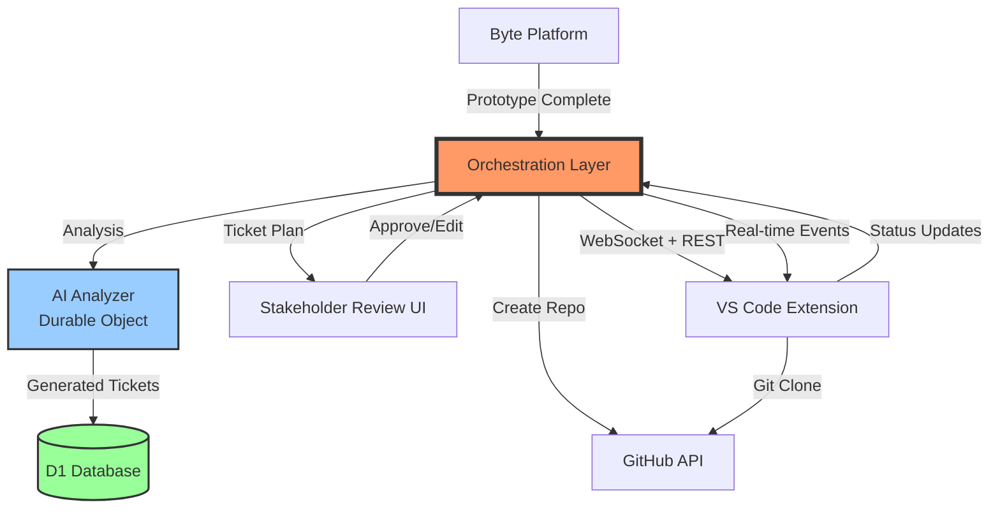
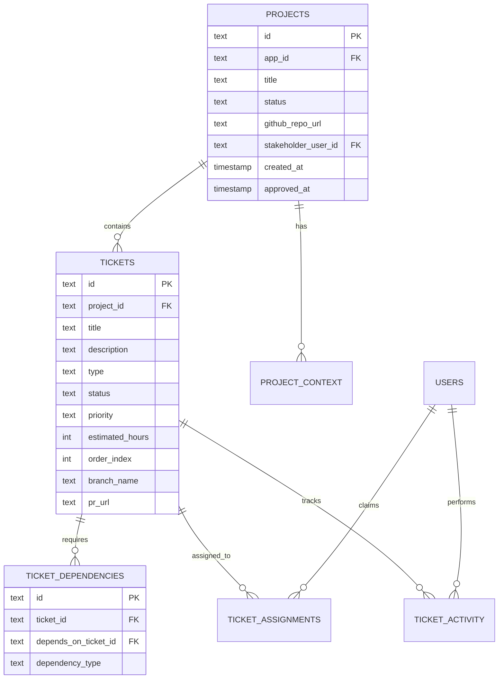
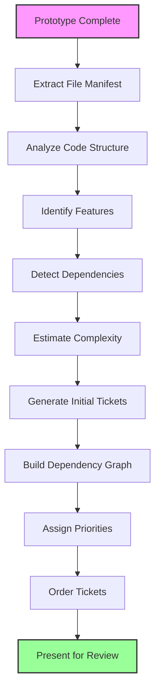
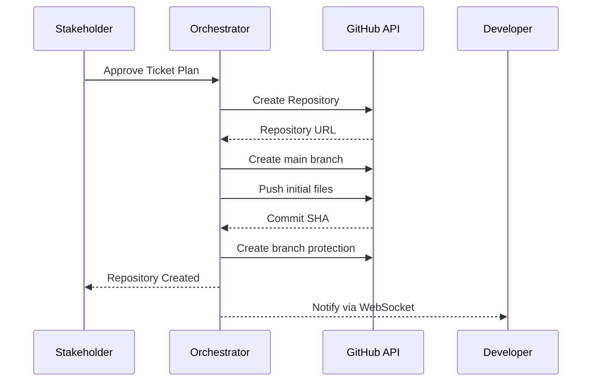
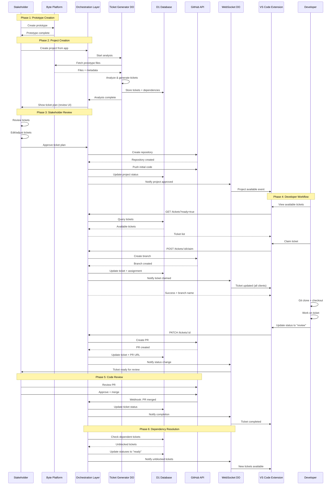
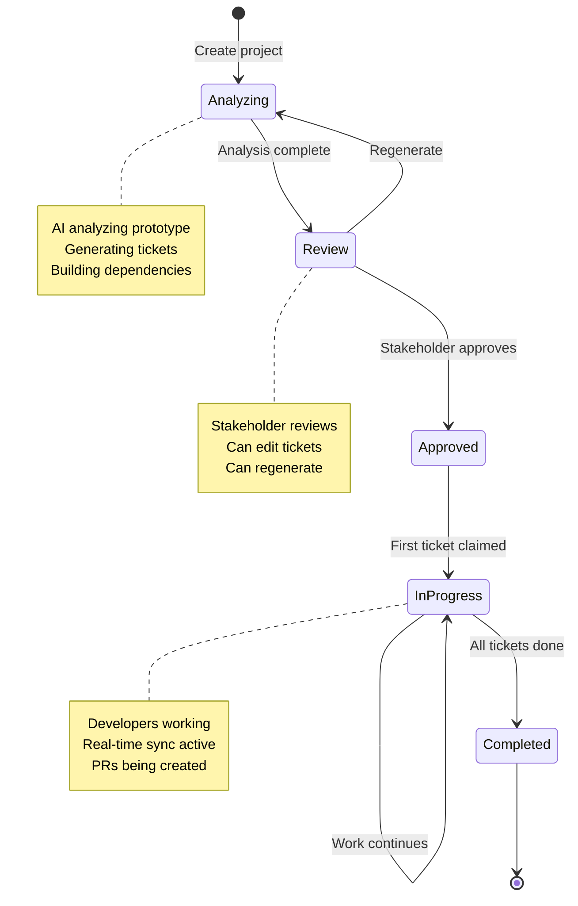
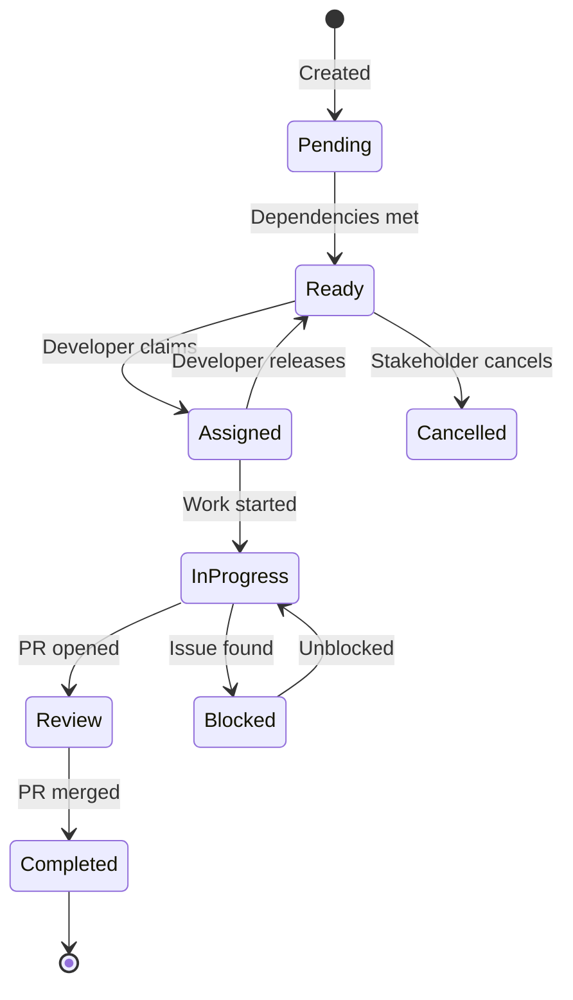
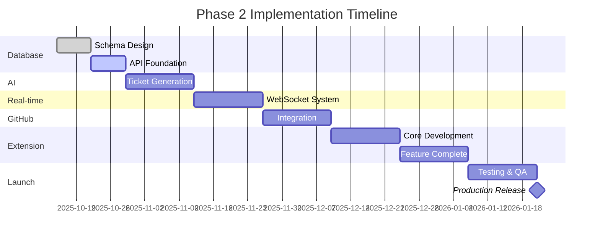

# Phase 2: Orchestration Layer Architecture

**Version:** 1.0  
**Date:** October 12, 2025  
**Status:** Draft for Review  

---

## Table of Contents

1. [Executive Summary](#executive-summary)
2. [System Overview](#system-overview)
3. [Database Schema](#database-schema)
4. [Ticket Generation Algorithm](#ticket-generation-algorithm)
5. [REST API Specification](#rest-api-specification)
6. [WebSocket Protocol](#websocket-protocol)
7. [GitHub Integration Strategy](#github-integration-strategy)
8. [VS Code Extension Integration](#vs-code-extension-integration)
9. [Data Flow Architecture](#data-flow-architecture)
10. [Security Considerations](#security-considerations)
11. [Performance Optimization](#performance-optimization)
12. [Implementation Roadmap](#implementation-roadmap)

---

## Executive Summary

### Purpose

The **Orchestration Layer** bridges the gap between prototype creation on Byte Platform and production-ready development by intelligent developers. It automatically analyzes completed prototypes, generates structured development tickets, and manages the entire development lifecycle through seamless integration with a custom VS Code extension.

### Key Features

- **🤖 AI-Powered Analysis**: Automatic prototype analysis to extract features, dependencies, and complexity
- **📋 Intelligent Ticket Generation**: Smart breakdown of work into logical, dependency-aware tickets
- **👀 Stakeholder Review**: Editable ticket plans before finalization
- **🔄 Real-time Sync**: WebSocket-based bidirectional sync with VS Code extension
- **🎯 GitHub Integration**: Automatic repository creation, branch management, and PR workflow
- **🔐 Enterprise Security**: JWT authentication, encrypted data, audit trails
- **⚡ High Performance**: Designed for <100ms response times using Cloudflare infrastructure

### Architecture Principles

1. **Cloudflare-First**: Leverage D1, Durable Objects, KV, and Workers for edge performance
2. **Offline-Capable**: VS Code extension works offline with intelligent sync
3. **Idempotent Operations**: All mutations are safe to retry
4. **Event-Driven**: WebSocket events for real-time collaboration
5. **Extensible**: Design accommodates future integrations (Linear, Jira, etc.)

---

## System Overview

### High-Level Architecture



### Component Overview

| Component | Technology | Purpose |
|-----------|-----------|---------|
| **Orchestration API** | Cloudflare Workers | REST endpoints for ticket management |
| **Ticket Generator** | Durable Object | Stateful AI-powered ticket generation |
| **WebSocket Server** | Durable Object | Real-time bidirectional sync |
| **Database** | Cloudflare D1 (SQLite) | Persistent storage for projects/tickets |
| **Cache Layer** | KV Store | Session data, active connections |
| **VS Code Extension** | TypeScript | Developer ticket interface |
| **GitHub Integration** | GitHub API v3 | Repository and workflow automation |

---

## Database Schema

### Entity Relationship Diagram



### Complete SQL Schema

```sql
-- ========================================
-- PROJECTS TABLE
-- ========================================
CREATE TABLE IF NOT EXISTS orchestration_projects (
    id TEXT PRIMARY KEY,
    
    -- Relationship to Byte Platform app
    app_id TEXT NOT NULL REFERENCES apps(id) ON DELETE CASCADE,
    
    -- Project Identity
    title TEXT NOT NULL,
    description TEXT,
    
    -- Status Management
    status TEXT NOT NULL DEFAULT 'analyzing' CHECK (status IN (
        'analyzing',      -- AI is analyzing prototype
        'review',         -- Awaiting stakeholder review
        'approved',       -- Stakeholder approved ticket plan
        'in_progress',    -- Development in progress
        'completed',      -- All tickets completed
        'archived'        -- Project archived
    )),
    
    -- GitHub Integration
    github_repo_url TEXT,
    github_repo_name TEXT,
    github_default_branch TEXT DEFAULT 'main',
    
    -- Ownership
    stakeholder_user_id TEXT REFERENCES users(id) ON DELETE SET NULL,
    
    -- Analysis Results (JSON)
    analysis_result TEXT, -- JSON: complexity, features, tech stack
    
    -- Statistics (cached for performance)
    total_tickets INTEGER DEFAULT 0,
    completed_tickets INTEGER DEFAULT 0,
    
    -- Timestamps
    created_at INTEGER NOT NULL DEFAULT (unixepoch()),
    analyzed_at INTEGER, -- When AI analysis completed
    approved_at INTEGER, -- When stakeholder approved
    completed_at INTEGER, -- When all tickets completed
    
    -- Indexes
    UNIQUE(app_id)
);

CREATE INDEX idx_projects_status ON orchestration_projects(status);
CREATE INDEX idx_projects_stakeholder ON orchestration_projects(stakeholder_user_id);
CREATE INDEX idx_projects_created ON orchestration_projects(created_at DESC);

-- ========================================
-- TICKETS TABLE
-- ========================================
CREATE TABLE IF NOT EXISTS orchestration_tickets (
    id TEXT PRIMARY KEY,
    project_id TEXT NOT NULL REFERENCES orchestration_projects(id) ON DELETE CASCADE,
    
    -- Ticket Identity
    title TEXT NOT NULL,
    description TEXT NOT NULL, -- Markdown format
    
    -- Classification
    type TEXT NOT NULL CHECK (type IN (
        'feature',        -- New feature implementation
        'enhancement',    -- Enhancement to existing feature
        'bug',           -- Bug fix
        'refactor',      -- Code refactoring
        'test',          -- Test implementation
        'documentation', -- Documentation
        'setup'          -- Project setup/configuration
    )),
    
    -- Priority & Estimation
    priority TEXT NOT NULL DEFAULT 'medium' CHECK (priority IN (
        'critical',
        'high',
        'medium',
        'low'
    )),
    estimated_hours INTEGER, -- AI-estimated effort in hours
    actual_hours INTEGER,    -- Developer-reported time
    
    -- Status Management
    status TEXT NOT NULL DEFAULT 'pending' CHECK (status IN (
        'pending',       -- Not yet started
        'ready',         -- Dependencies met, ready to start
        'assigned',      -- Assigned to developer
        'in_progress',   -- Being worked on
        'review',        -- In code review
        'blocked',       -- Blocked by dependencies
        'completed',     -- Finished
        'cancelled'      -- Cancelled by stakeholder
    )),
    
    -- Order and Organization
    order_index INTEGER NOT NULL, -- Display order
    category TEXT, -- Optional grouping (e.g., "Frontend", "Backend")
    tags TEXT,     -- JSON array of tags
    
    -- Git Integration
    branch_name TEXT,
    pr_url TEXT,
    commit_count INTEGER DEFAULT 0,
    
    -- File References (JSON)
    affected_files TEXT, -- JSON: [{path, reason, type}]
    
    -- Acceptance Criteria (JSON)
    acceptance_criteria TEXT, -- JSON: [{criterion, completed}]
    
    -- Metadata
    created_at INTEGER NOT NULL DEFAULT (unixepoch()),
    updated_at INTEGER NOT NULL DEFAULT (unixepoch()),
    started_at INTEGER,   -- When developer started work
    completed_at INTEGER  -- When marked complete
);

CREATE INDEX idx_tickets_project ON orchestration_tickets(project_id);
CREATE INDEX idx_tickets_status ON orchestration_tickets(status);
CREATE INDEX idx_tickets_priority ON orchestration_tickets(priority);
CREATE INDEX idx_tickets_order ON orchestration_tickets(project_id, order_index);
CREATE INDEX idx_tickets_branch ON orchestration_tickets(branch_name) WHERE branch_name IS NOT NULL;

-- ========================================
-- TICKET DEPENDENCIES TABLE
-- ========================================
CREATE TABLE IF NOT EXISTS orchestration_ticket_dependencies (
    id TEXT PRIMARY KEY,
    ticket_id TEXT NOT NULL REFERENCES orchestration_tickets(id) ON DELETE CASCADE,
    depends_on_ticket_id TEXT NOT NULL REFERENCES orchestration_tickets(id) ON DELETE CASCADE,
    
    -- Dependency Type
    dependency_type TEXT NOT NULL DEFAULT 'blocks' CHECK (dependency_type IN (
        'blocks',        -- Must complete before starting
        'related',       -- Loosely related
        'file_conflict'  -- Works on same files
    )),
    
    -- Metadata
    created_at INTEGER NOT NULL DEFAULT (unixepoch()),
    
    -- Constraints
    UNIQUE(ticket_id, depends_on_ticket_id),
    CHECK(ticket_id != depends_on_ticket_id)
);

CREATE INDEX idx_dependencies_ticket ON orchestration_ticket_dependencies(ticket_id);
CREATE INDEX idx_dependencies_blocks ON orchestration_ticket_dependencies(depends_on_ticket_id);

-- ========================================
-- TICKET ASSIGNMENTS TABLE
-- ========================================
CREATE TABLE IF NOT EXISTS orchestration_ticket_assignments (
    id TEXT PRIMARY KEY,
    ticket_id TEXT NOT NULL REFERENCES orchestration_tickets(id) ON DELETE CASCADE,
    user_id TEXT NOT NULL REFERENCES users(id) ON DELETE CASCADE,
    
    -- Assignment Status
    status TEXT NOT NULL DEFAULT 'assigned' CHECK (status IN (
        'assigned',      -- Currently assigned
        'unassigned',    -- Was assigned, now released
        'completed'      -- Assignment completed
    )),
    
    -- Timestamps
    assigned_at INTEGER NOT NULL DEFAULT (unixepoch()),
    unassigned_at INTEGER,
    completed_at INTEGER,
    
    -- Constraints
    UNIQUE(ticket_id, user_id, status)
);

CREATE INDEX idx_assignments_ticket ON orchestration_ticket_assignments(ticket_id);
CREATE INDEX idx_assignments_user ON orchestration_ticket_assignments(user_id, status);
CREATE INDEX idx_assignments_active ON orchestration_ticket_assignments(status) WHERE status = 'assigned';

-- ========================================
-- TICKET ACTIVITY TABLE
-- ========================================
CREATE TABLE IF NOT EXISTS orchestration_ticket_activity (
    id TEXT PRIMARY KEY,
    ticket_id TEXT NOT NULL REFERENCES orchestration_tickets(id) ON DELETE CASCADE,
    user_id TEXT REFERENCES users(id) ON DELETE SET NULL,
    
    -- Activity Details
    action TEXT NOT NULL CHECK (action IN (
        'created',
        'status_changed',
        'assigned',
        'unassigned',
        'comment_added',
        'priority_changed',
        'description_updated',
        'branch_created',
        'pr_opened',
        'pr_merged',
        'completed',
        'reopened'
    )),
    
    -- Change Details (JSON)
    details TEXT, -- JSON: {from, to, comment, etc.}
    
    -- Context
    source TEXT DEFAULT 'web' CHECK (source IN (
        'web',        -- Byte Platform web UI
        'vscode',     -- VS Code extension
        'api',        -- Direct API call
        'system'      -- Automated system action
    )),
    
    -- Timestamp
    created_at INTEGER NOT NULL DEFAULT (unixepoch())
);

CREATE INDEX idx_activity_ticket ON orchestration_ticket_activity(ticket_id, created_at DESC);
CREATE INDEX idx_activity_user ON orchestration_ticket_activity(user_id, created_at DESC);

-- ========================================
-- PROJECT CONTEXT TABLE
-- ========================================
CREATE TABLE IF NOT EXISTS orchestration_project_context (
    id TEXT PRIMARY KEY,
    project_id TEXT NOT NULL REFERENCES orchestration_projects(id) ON DELETE CASCADE,
    
    -- Context Type
    context_type TEXT NOT NULL CHECK (context_type IN (
        'tech_stack',      -- Technologies used
        'file_structure',  -- Project file organization
        'dependencies',    -- NPM/package dependencies
        'api_endpoints',   -- API routes defined
        'database_schema', -- Database tables/fields
        'environment_vars', -- Required env variables
        'features'         -- High-level features list
    )),
    
    -- Context Data (JSON)
    data TEXT NOT NULL, -- JSON object with context-specific structure
    
    -- Metadata
    created_at INTEGER NOT NULL DEFAULT (unixepoch()),
    updated_at INTEGER NOT NULL DEFAULT (unixepoch()),
    
    -- Constraints
    UNIQUE(project_id, context_type)
);

CREATE INDEX idx_context_project ON orchestration_project_context(project_id);
CREATE INDEX idx_context_type ON orchestration_project_context(context_type);

-- ========================================
-- WEBSOCKET CONNECTIONS TABLE (KV Alternative)
-- ========================================
CREATE TABLE IF NOT EXISTS orchestration_ws_connections (
    id TEXT PRIMARY KEY,
    user_id TEXT NOT NULL REFERENCES users(id) ON DELETE CASCADE,
    project_id TEXT REFERENCES orchestration_projects(id) ON DELETE CASCADE,
    
    -- Connection Details
    connection_id TEXT NOT NULL UNIQUE,
    client_type TEXT NOT NULL CHECK (client_type IN ('web', 'vscode')),
    
    -- State
    is_active INTEGER NOT NULL DEFAULT 1,
    
    -- Metadata
    connected_at INTEGER NOT NULL DEFAULT (unixepoch()),
    last_heartbeat INTEGER NOT NULL DEFAULT (unixepoch()),
    
    -- Cleanup
    expires_at INTEGER NOT NULL
);

CREATE INDEX idx_ws_user ON orchestration_ws_connections(user_id);
CREATE INDEX idx_ws_project ON orchestration_ws_connections(project_id);
CREATE INDEX idx_ws_active ON orchestration_ws_connections(is_active, expires_at);
```

---

## Ticket Generation Algorithm

### Overview

The ticket generation algorithm analyzes a completed Byte Platform prototype and intelligently breaks it down into development tickets with proper dependencies, priorities, and estimates.

### Algorithm Phases



### Detailed Pseudocode

```typescript
/**
 * Main ticket generation algorithm
 */
async function generateTickets(prototype: Prototype): Promise<TicketPlan> {
    // Phase 1: Extract and Parse
    const fileManifest = await extractFileManifest(prototype);
    const codeStructure = await analyzeCodeStructure(fileManifest);
    
    // Phase 2: Feature Detection
    const features = await identifyFeatures(codeStructure, prototype.description);
    const components = await detectComponents(codeStructure);
    const apiEndpoints = await detectAPIEndpoints(codeStructure);
    
    // Phase 3: Dependency Analysis
    const fileDependencies = await buildFileDependencyGraph(fileManifest);
    const featureDependencies = await mapFeatureDependencies(features, fileDependencies);
    
    // Phase 4: Complexity Estimation
    const complexityScores = await estimateComplexity(features, components, codeStructure);
    
    // Phase 5: Ticket Generation
    const initialTickets = await createInitialTickets(
        features,
        components,
        apiEndpoints,
        complexityScores
    );
    
    // Phase 6: Dependency Mapping
    const ticketDependencies = await buildTicketDependencyGraph(
        initialTickets,
        featureDependencies,
        fileDependencies
    );
    
    // Phase 7: Prioritization
    const prioritizedTickets = await assignPriorities(
        initialTickets,
        ticketDependencies,
        complexityScores
    );
    
    // Phase 8: Ordering
    const orderedTickets = await topologicalSort(
        prioritizedTickets,
        ticketDependencies
    );
    
    // Phase 9: Validation
    const validatedPlan = await validateTicketPlan(
        orderedTickets,
        ticketDependencies,
        prototype
    );
    
    return validatedPlan;
}

/**
 * File manifest extraction
 */
async function extractFileManifest(prototype: Prototype): Promise<FileManifest> {
    return {
        files: prototype.files.map(file => ({
            path: file.filePath,
            content: file.fileContents,
            language: detectLanguage(file.filePath),
            size: file.fileContents.length,
            hash: hashContent(file.fileContents)
        })),
        totalFiles: prototype.files.length,
        totalLines: sumLines(prototype.files)
    };
}

/**
 * Code structure analysis using AST parsing
 */
async function analyzeCodeStructure(manifest: FileManifest): Promise<CodeStructure> {
    const structure: CodeStructure = {
        components: [],
        functions: [],
        imports: [],
        exports: [],
        routes: [],
        stateManagement: []
    };
    
    for (const file of manifest.files) {
        const ast = await parseFile(file);
        
        // Extract components (React/Vue/etc.)
        if (isComponentFile(file)) {
            structure.components.push(...extractComponents(ast, file));
        }
        
        // Extract functions
        structure.functions.push(...extractFunctions(ast, file));
        
        // Extract imports/exports
        structure.imports.push(...extractImports(ast, file));
        structure.exports.push(...extractExports(ast, file));
        
        // Extract routes (if backend or router)
        if (isRouteFile(file)) {
            structure.routes.push(...extractRoutes(ast, file));
        }
        
        // Detect state management
        if (hasStateManagement(ast)) {
            structure.stateManagement.push(...extractState(ast, file));
        }
    }
    
    return structure;
}

/**
 * Feature identification using AI
 */
async function identifyFeatures(
    structure: CodeStructure,
    description: string
): Promise<Feature[]> {
    const prompt = `
Analyze this application structure and identify distinct features:

Description: ${description}

Components: ${structure.components.map(c => c.name).join(', ')}
Routes: ${structure.routes.map(r => r.path).join(', ')}
State: ${structure.stateManagement.length} state objects

For each feature, provide:
- Name (concise, action-oriented)
- Description (what it does)
- Files involved
- Complexity (1-10)
- User-facing or internal
    `;
    
    const response = await aiInference(prompt, {
        model: 'claude-sonnet-4-5',
        schema: FeaturesSchema
    });
    
    return response.features;
}

/**
 * Dependency graph construction
 */
async function buildFileDependencyGraph(
    manifest: FileManifest
): Promise<DependencyGraph> {
    const graph = new Map<string, Set<string>>();
    
    for (const file of manifest.files) {
        const deps = new Set<string>();
        const imports = extractImportPaths(file);
        
        for (const importPath of imports) {
            const resolvedPath = resolveImportPath(importPath, file.path);
            if (resolvedPath && manifest.files.some(f => f.path === resolvedPath)) {
                deps.add(resolvedPath);
            }
        }
        
        graph.set(file.path, deps);
    }
    
    return graph;
}

/**
 * Complexity estimation algorithm
 */
async function estimateComplexity(
    features: Feature[],
    components: Component[],
    structure: CodeStructure
): Promise<Map<string, ComplexityScore>> {
    const scores = new Map<string, ComplexityScore>();
    
    for (const feature of features) {
        let score = 0;
        
        // Factor 1: Lines of code
        const totalLines = feature.files.reduce((sum, f) => 
            sum + getFileLOC(f), 0
        );
        score += Math.min(totalLines / 100, 5); // Max 5 points
        
        // Factor 2: Number of components
        score += Math.min(feature.components.length * 0.5, 3); // Max 3 points
        
        // Factor 3: State complexity
        const stateObjects = countStateObjects(feature);
        score += Math.min(stateObjects * 0.3, 2); // Max 2 points
        
        // Factor 4: API integration
        const apiCalls = countAPICalls(feature);
        score += Math.min(apiCalls * 0.2, 2); // Max 2 points
        
        // Factor 5: Dependencies
        const deps = countDependencies(feature);
        score += Math.min(deps * 0.1, 3); // Max 3 points
        
        scores.set(feature.id, {
            total: Math.min(score, 10),
            factors: {
                lines: totalLines,
                components: feature.components.length,
                state: stateObjects,
                api: apiCalls,
                dependencies: deps
            }
        });
    }
    
    return scores;
}

/**
 * Initial ticket creation
 */
async function createInitialTickets(
    features: Feature[],
    components: Component[],
    apiEndpoints: APIEndpoint[],
    complexity: Map<string, ComplexityScore>
): Promise<Ticket[]> {
    const tickets: Ticket[] = [];
    
    // Setup ticket (always first)
    tickets.push({
        id: generateId(),
        type: 'setup',
        title: 'Project Setup and Configuration',
        description: generateSetupDescription(),
        priority: 'critical',
        estimatedHours: 2,
        order: 0,
        affectedFiles: ['package.json', 'tsconfig.json', 'vite.config.ts']
    });
    
    // Feature tickets
    for (const feature of features) {
        const complexityScore = complexity.get(feature.id)!;
        
        tickets.push({
            id: generateId(),
            type: 'feature',
            title: `Implement ${feature.name}`,
            description: generateFeatureDescription(feature, complexityScore),
            priority: determineInitialPriority(feature),
            estimatedHours: estimateHours(complexityScore.total),
            affectedFiles: feature.files,
            acceptanceCriteria: generateAcceptanceCriteria(feature)
        });
    }
    
    // Component refactor tickets (if needed)
    const sharedComponents = findSharedComponents(components);
    for (const comp of sharedComponents) {
        tickets.push({
            id: generateId(),
            type: 'refactor',
            title: `Extract ${comp.name} as Shared Component`,
            description: generateRefactorDescription(comp),
            priority: 'low',
            estimatedHours: estimateRefactorHours(comp)
        });
    }
    
    return tickets;
}

/**
 * Ticket dependency graph construction
 */
async function buildTicketDependencyGraph(
    tickets: Ticket[],
    featureDeps: Map<string, Set<string>>,
    fileDeps: DependencyGraph
): Promise<TicketDependencyGraph> {
    const graph = new Map<string, Dependency[]>();
    
    for (const ticket of tickets) {
        const deps: Dependency[] = [];
        
        // Rule 1: Setup must be first
        if (ticket.type !== 'setup') {
            const setupTicket = tickets.find(t => t.type === 'setup');
            if (setupTicket) {
                deps.push({
                    ticketId: setupTicket.id,
                    type: 'blocks',
                    reason: 'Project setup required'
                });
            }
        }
        
        // Rule 2: File dependencies
        for (const otherTicket of tickets) {
            if (otherTicket.id === ticket.id) continue;
            
            const hasFileConflict = ticket.affectedFiles.some(f1 =>
                otherTicket.affectedFiles.some(f2 =>
                    fileDeps.get(f2)?.has(f1) ?? false
                )
            );
            
            if (hasFileConflict) {
                deps.push({
                    ticketId: otherTicket.id,
                    type: 'file_conflict',
                    reason: 'Works on dependent files'
                });
            }
        }
        
        // Rule 3: Feature dependencies
        const featureDepsForTicket = featureDeps.get(ticket.id);
        if (featureDepsForTicket) {
            for (const depId of featureDepsForTicket) {
                const depTicket = tickets.find(t => t.id === depId);
                if (depTicket) {
                    deps.push({
                        ticketId: depTicket.id,
                        type: 'blocks',
                        reason: 'Feature dependency'
                    });
                }
            }
        }
        
        graph.set(ticket.id, deps);
    }
    
    return graph;
}

/**
 * Priority assignment based on dependencies and complexity
 */
async function assignPriorities(
    tickets: Ticket[],
    dependencies: TicketDependencyGraph,
    complexity: Map<string, ComplexityScore>
): Promise<Ticket[]> {
    const priorityMap = new Map<string, Priority>();
    
    for (const ticket of tickets) {
        let priority: Priority = 'medium';
        
        // Critical: Setup and blocking others
        const blocksCount = countBlockedTickets(ticket.id, dependencies);
        if (ticket.type === 'setup' || blocksCount > 5) {
            priority = 'critical';
        }
        // High: Blocks multiple or high complexity
        else if (blocksCount > 2 || complexity.get(ticket.id)?.total > 7) {
            priority = 'high';
        }
        // Low: No blockers, low complexity
        else if (blocksCount === 0 && complexity.get(ticket.id)?.total < 3) {
            priority = 'low';
        }
        
        priorityMap.set(ticket.id, priority);
        ticket.priority = priority;
    }
    
    return tickets;
}

/**
 * Topological sort for optimal work order
 */
async function topologicalSort(
    tickets: Ticket[],
    dependencies: TicketDependencyGraph
): Promise<Ticket[]> {
    const sorted: Ticket[] = [];
    const visited = new Set<string>();
    const temp = new Set<string>();
    
    function visit(ticketId: string) {
        if (temp.has(ticketId)) {
            throw new Error('Circular dependency detected');
        }
        if (visited.has(ticketId)) {
            return;
        }
        
        temp.add(ticketId);
        
        const deps = dependencies.get(ticketId) || [];
        for (const dep of deps) {
            if (dep.type === 'blocks') {
                visit(dep.ticketId);
            }
        }
        
        temp.delete(ticketId);
        visited.add(ticketId);
        
        const ticket = tickets.find(t => t.id === ticketId)!;
        sorted.push(ticket);
    }
    
    for (const ticket of tickets) {
        if (!visited.has(ticket.id)) {
            visit(ticket.id);
        }
    }
    
    // Assign order indices
    sorted.forEach((ticket, index) => {
        ticket.order = index;
    });
    
    return sorted;
}

/**
 * Validation of ticket plan
 */
async function validateTicketPlan(
    tickets: Ticket[],
    dependencies: TicketDependencyGraph,
    prototype: Prototype
): Promise<TicketPlan> {
    // Check for circular dependencies
    detectCircularDependencies(dependencies);
    
    // Validate all files are covered
    const coveredFiles = new Set(tickets.flatMap(t => t.affectedFiles));
    const allFiles = new Set(prototype.files.map(f => f.filePath));
    const uncoveredFiles = difference(allFiles, coveredFiles);
    
    if (uncoveredFiles.size > 0) {
        console.warn('Uncovered files:', uncoveredFiles);
    }
    
    // Validate total estimates
    const totalHours = tickets.reduce((sum, t) => sum + t.estimatedHours, 0);
    if (totalHours < 10 || totalHours > 500) {
        console.warn('Unusual total estimate:', totalHours);
    }
    
    return {
        tickets,
        dependencies,
        metadata: {
            totalTickets: tickets.length,
            totalEstimatedHours: totalHours,
            criticalTickets: tickets.filter(t => t.priority === 'critical').length,
            averageComplexity: calculateAverageComplexity(tickets)
        }
    };
}
```

### AI Model Configuration

```typescript
// Recommended model for ticket generation
const TICKET_GENERATION_CONFIG = {
    model: 'claude-sonnet-4-5',
    temperature: 0.3, // Lower for consistency
    maxTokens: 8000,
    reasoningEffort: 'high'
};
```

---

## REST API Specification

### Base Configuration

```yaml
openapi: 3.1.0
info:
  title: Orchestration Layer API
  version: 1.0.0
  description: API for managing development projects and tickets
servers:
  - url: https://build.cloudflare.dev/api/orchestrator
    description: Production server
  - url: http://localhost:5173/api/orchestrator
    description: Development server

components:
  securitySchemes:
    bearerAuth:
      type: http
      scheme: bearer
      bearerFormat: JWT
  
  schemas:
    Project:
      type: object
      required: [id, appId, title, status]
      properties:
        id:
          type: string
          format: uuid
        appId:
          type: string
          format: uuid
        title:
          type: string
        description:
          type: string
        status:
          type: string
          enum: [analyzing, review, approved, in_progress, completed, archived]
        githubRepoUrl:
          type: string
          format: uri
        totalTickets:
          type: integer
        completedTickets:
          type: integer
        createdAt:
          type: string
          format: date-time
        approvedAt:
          type: string
          format: date-time
    
    Ticket:
      type: object
      required: [id, projectId, title, description, type, status, priority]
      properties:
        id:
          type: string
          format: uuid
        projectId:
          type: string
          format: uuid
        title:
          type: string
        description:
          type: string
        type:
          type: string
          enum: [feature, enhancement, bug, refactor, test, documentation, setup]
        status:
          type: string
          enum: [pending, ready, assigned, in_progress, review, blocked, completed, cancelled]
        priority:
          type: string
          enum: [critical, high, medium, low]
        estimatedHours:
          type: integer
        actualHours:
          type: integer
        orderIndex:
          type: integer
        branchName:
          type: string
        prUrl:
          type: string
          format: uri
        affectedFiles:
          type: array
          items:
            type: object
            properties:
              path:
                type: string
              reason:
                type: string
        acceptanceCriteria:
          type: array
          items:
            type: object
            properties:
              criterion:
                type: string
              completed:
                type: boolean
        assignee:
          $ref: '#/components/schemas/User'
        dependencies:
          type: array
          items:
            $ref: '#/components/schemas/TicketDependency'
    
    TicketDependency:
      type: object
      required: [id, ticketId, dependsOnTicketId, type]
      properties:
        id:
          type: string
          format: uuid
        ticketId:
          type: string
          format: uuid
        dependsOnTicketId:
          type: string
          format: uuid
        type:
          type: string
          enum: [blocks, related, file_conflict]
    
    User:
      type: object
      properties:
        id:
          type: string
          format: uuid
        email:
          type: string
          format: email
        displayName:
          type: string
    
    Error:
      type: object
      required: [error, message]
      properties:
        error:
          type: string
        message:
          type: string
        details:
          type: object

security:
  - bearerAuth: []
```

### Endpoints

#### 1. Create Project from Prototype

```yaml
paths:
  /api/orchestrator/projects:
    post:
      summary: Create a new project from completed prototype
      operationId: createProject
      tags: [Projects]
      requestBody:
        required: true
        content:
          application/json:
            schema:
              type: object
              required: [appId]
              properties:
                appId:
                  type: string
                  format: uuid
                  description: ID of completed Byte Platform app
                title:
                  type: string
                  description: Optional custom title (defaults to app title)
      responses:
        '201':
          description: Project created and analysis started
          content:
            application/json:
              schema:
                type: object
                properties:
                  success:
                    type: boolean
                  project:
                    $ref: '#/components/schemas/Project'
                  message:
                    type: string
        '400':
          description: Invalid request
          content:
            application/json:
              schema:
                $ref: '#/components/schemas/Error'
        '404':
          description: App not found
          content:
            application/json:
              schema:
                $ref: '#/components/schemas/Error'
```

#### 2. Get Project with Tickets

```yaml
  /api/orchestrator/projects/{projectId}:
    get:
      summary: Get project details with all tickets
      operationId: getProject
      tags: [Projects]
      parameters:
        - name: projectId
          in: path
          required: true
          schema:
            type: string
            format: uuid
        - name: includeActivity
          in: query
          schema:
            type: boolean
            default: false
      responses:
        '200':
          description: Project found
          content:
            application/json:
              schema:
                type: object
                properties:
                  success:
                    type: boolean
                  project:
                    $ref: '#/components/schemas/Project'
                  tickets:
                    type: array
                    items:
                      $ref: '#/components/schemas/Ticket'
                  dependencies:
                    type: array
                    items:
                      $ref: '#/components/schemas/TicketDependency'
        '404':
          description: Project not found
```

#### 3. Approve Ticket Plan

```yaml
    patch:
      summary: Update project (approve ticket plan, etc.)
      operationId: updateProject
      tags: [Projects]
      parameters:
        - name: projectId
          in: path
          required: true
          schema:
            type: string
      requestBody:
        required: true
        content:
          application/json:
            schema:
              type: object
              properties:
                action:
                  type: string
                  enum: [approve, regenerate, archive]
                ticketUpdates:
                  type: array
                  description: Modifications to tickets before approval
                  items:
                    type: object
                    properties:
                      ticketId:
                        type: string
                      title:
                        type: string
                      description:
                        type: string
                      priority:
                        type: string
      responses:
        '200':
          description: Project updated successfully
```

#### 4. List Tickets for VS Code Extension

```yaml
  /api/orchestrator/tickets:
    get:
      summary: List available tickets for developers
      operationId: listTickets
      tags: [Tickets]
      parameters:
        - name: projectId
          in: query
          schema:
            type: string
        - name: status
          in: query
          schema:
            type: array
            items:
              type: string
        - name: assignedToMe
          in: query
          schema:
            type: boolean
        - name: ready
          in: query
          description: Only tickets with no blocking dependencies
          schema:
            type: boolean
      responses:
        '200':
          description: List of tickets
          content:
            application/json:
              schema:
                type: object
                properties:
                  success:
                    type: boolean
                  tickets:
                    type: array
                    items:
                      $ref: '#/components/schemas/Ticket'
                  pagination:
                    type: object
```

#### 5. Claim Ticket

```yaml
  /api/orchestrator/tickets/{ticketId}/claim:
    post:
      summary: Assign ticket to current user
      operationId: claimTicket
      tags: [Tickets]
      parameters:
        - name: ticketId
          in: path
          required: true
          schema:
            type: string
      responses:
        '200':
          description: Ticket claimed successfully
          content:
            application/json:
              schema:
                type: object
                properties:
                  success:
                    type: boolean
                  ticket:
                    $ref: '#/components/schemas/Ticket'
                  branchName:
                    type: string
                    description: Auto-generated branch name
        '409':
          description: Ticket already assigned or dependencies not met
```

#### 6. Update Ticket Status

```yaml
  /api/orchestrator/tickets/{ticketId}:
    patch:
      summary: Update ticket status and metadata
      operationId: updateTicket
      tags: [Tickets]
      parameters:
        - name: ticketId
          in: path
          required: true
          schema:
            type: string
      requestBody:
        required: true
        content:
          application/json:
            schema:
              type: object
              properties:
                status:
                  type: string
                  enum: [in_progress, review, blocked, completed]
                actualHours:
                  type: integer
                branchName:
                  type: string
                prUrl:
                  type: string
                notes:
                  type: string
      responses:
        '200':
          description: Ticket updated
          content:
            application/json:
              schema:
                type: object
                properties:
                  success:
                    type: boolean
                  ticket:
                    $ref: '#/components/schemas/Ticket'
```

#### 7. Regenerate Tickets

```yaml
  /api/orchestrator/projects/{projectId}/regenerate:
    post:
      summary: Regenerate ticket plan with optional guidance
      operationId: regenerateTickets
      tags: [Projects]
      parameters:
        - name: projectId
          in: path
          required: true
          schema:
            type: string
      requestBody:
        content:
          application/json:
            schema:
              type: object
              properties:
                guidance:
                  type: string
                  description: Additional instructions for regeneration
                keepTickets:
                  type: array
                  items:
                    type: string
                  description: IDs of tickets to preserve
      responses:
        '202':
          description: Regeneration started
          content:
            application/json:
              schema:
                type: object
                properties:
                  success:
                    type: boolean
                  message:
                    type: string
```

---

## WebSocket Protocol

### Connection

```typescript
// Client initiates connection
const ws = new WebSocket('wss://build.cloudflare.dev/api/orchestrator/ws');

// Authentication via initial message
ws.send(JSON.stringify({
    type: 'authenticate',
    token: 'JWT_TOKEN',
    clientType: 'vscode', // or 'web'
    projectId: 'optional-project-id'
}));
```

### Message Types

#### Server → Client

```typescript
// 1. Authentication Response
{
    type: 'auth_success',
    userId: string,
    connectionId: string,
    subscriptions: string[] // Project IDs
}

// 2. Ticket Created
{
    type: 'ticket_created',
    projectId: string,
    ticket: Ticket
}

// 3. Ticket Updated
{
    type: 'ticket_updated',
    projectId: string,
    ticketId: string,
    changes: {
        field: string,
        oldValue: any,
        newValue: any
    }[],
    updatedBy: {
        userId: string,
        displayName: string,
        source: 'web' | 'vscode' | 'system'
    }
}

// 4. Ticket Status Changed
{
    type: 'ticket_status_changed',
    projectId: string,
    ticketId: string,
    oldStatus: TicketStatus,
    newStatus: TicketStatus,
    changedBy: User
}

// 5. Ticket Assigned
{
    type: 'ticket_assigned',
    projectId: string,
    ticketId: string,
    assignee: User,
    branchName: string
}

// 6. Project Status Changed
{
    type: 'project_status_changed',
    projectId: string,
    oldStatus: ProjectStatus,
    newStatus: ProjectStatus
}

// 7. Ticket Dependencies Updated
{
    type: 'dependencies_updated',
    projectId: string,
    ticketId: string,
    unblockedTickets: string[] // IDs of tickets now ready
}

// 8. Activity Added
{
    type: 'activity_added',
    projectId: string,
    ticketId: string,
    activity: TicketActivity
}

// 9. Heartbeat
{
    type: 'heartbeat',
    timestamp: string
}

// 10. Error
{
    type: 'error',
    error: string,
    message: string,
    recoverable: boolean
}
```

#### Client → Server

```typescript
// 1. Authentication
{
    type: 'authenticate',
    token: string,
    clientType: 'web' | 'vscode',
    projectId?: string
}

// 2. Subscribe to Project
{
    type: 'subscribe',
    projectId: string
}

// 3. Unsubscribe from Project
{
    type: 'unsubscribe',
    projectId: string
}

// 4. Heartbeat Response
{
    type: 'pong',
    timestamp: string
}

// 5. Request Sync
{
    type: 'request_sync',
    projectId: string,
    lastKnownVersion?: number
}
```

### Connection Management

```typescript
class OrchestratorWebSocketClient {
    private ws: WebSocket;
    private heartbeatInterval: NodeJS.Timeout;
    private reconnectAttempts = 0;
    private maxReconnectAttempts = 10;
    
    constructor(
        private url: string,
        private token: string,
        private onMessage: (msg: ServerMessage) => void
    ) {}
    
    connect() {
        this.ws = new WebSocket(this.url);
        
        this.ws.onopen = () => {
            console.log('WebSocket connected');
            this.authenticate();
            this.startHeartbeat();
            this.reconnectAttempts = 0;
        };
        
        this.ws.onmessage = (event) => {
            const message = JSON.parse(event.data);
            this.handleMessage(message);
        };
        
        this.ws.onclose = () => {
            console.log('WebSocket closed');
            this.stopHeartbeat();
            this.attemptReconnect();
        };
        
        this.ws.onerror = (error) => {
            console.error('WebSocket error:', error);
        };
    }
    
    private authenticate() {
        this.send({
            type: 'authenticate',
            token: this.token,
            clientType: 'vscode'
        });
    }
    
    private startHeartbeat() {
        this.heartbeatInterval = setInterval(() => {
            if (this.ws.readyState === WebSocket.OPEN) {
                this.send({ type: 'pong', timestamp: new Date().toISOString() });
            }
        }, 30000); // Every 30 seconds
    }
    
    private stopHeartbeat() {
        if (this.heartbeatInterval) {
            clearInterval(this.heartbeatInterval);
        }
    }
    
    private attemptReconnect() {
        if (this.reconnectAttempts < this.maxReconnectAttempts) {
            this.reconnectAttempts++;
            const delay = Math.min(1000 * Math.pow(2, this.reconnectAttempts), 30000);
            setTimeout(() => this.connect(), delay);
        }
    }
    
    private handleMessage(message: ServerMessage) {
        if (message.type === 'heartbeat') {
            // Respond to heartbeat
            this.send({ type: 'pong', timestamp: new Date().toISOString() });
        } else {
            this.onMessage(message);
        }
    }
    
    send(message: ClientMessage) {
        if (this.ws.readyState === WebSocket.OPEN) {
            this.ws.send(JSON.stringify(message));
        }
    }
    
    subscribe(projectId: string) {
        this.send({ type: 'subscribe', projectId });
    }
    
    disconnect() {
        this.stopHeartbeat();
        this.ws.close();
    }
}
```

---

## GitHub Integration Strategy

### Repository Creation Flow



### Implementation

```typescript
/**
 * Create repository and push initial code
 */
async function createProjectRepository(
    project: Project,
    githubToken: string
): Promise<RepositoryCreationResult> {
    const repoName = sanitizeRepoName(project.title);
    
    // 1. Create repository
    const repo = await githubService.createRepository({
        token: githubToken,
        name: repoName,
        description: project.description,
        private: true,
        auto_init: true
    });
    
    if (!repo.success) {
        return { success: false, error: repo.error };
    }
    
    // 2. Push initial code
    const files = await getPrototypeFiles(project.appId);
    const pushResult = await githubService.pushFiles({
        token: githubToken,
        repositoryHtmlUrl: repo.repository.html_url,
        cloneUrl: repo.repository.clone_url,
        files: files.map(f => ({
            filePath: f.filePath,
            fileContents: f.fileContents
        }))
    });
    
    if (!pushResult.success) {
        return { success: false, error: pushResult.error };
    }
    
    // 3. Set up branch protection
    await setupBranchProtection(
        githubToken,
        repo.repository.full_name,
        'main'
    );
    
    // 4. Update project in database
    await db.update(orchestrationProjects)
        .set({
            githubRepoUrl: repo.repository.html_url,
            githubRepoName: repo.repository.full_name,
            githubDefaultBranch: repo.repository.default_branch
        })
        .where(eq(orchestrationProjects.id, project.id));
    
    return {
        success: true,
        repositoryUrl: repo.repository.html_url,
        cloneUrl: repo.repository.clone_url
    };
}

/**
 * Setup branch protection rules
 */
async function setupBranchProtection(
    token: string,
    repoFullName: string,
    branch: string
) {
    const [owner, repo] = repoFullName.split('/');
    
    const octokit = new Octokit({ auth: token });
    
    await octokit.rest.repos.updateBranchProtection({
        owner,
        repo,
        branch,
        required_status_checks: null,
        enforce_admins: false,
        required_pull_request_reviews: {
            required_approving_review_count: 1,
            dismiss_stale_reviews: false
        },
        restrictions: null
    });
}
```

### Branch Creation Per Ticket

```typescript
/**
 * Create branch when developer claims ticket
 */
async function createTicketBranch(
    ticket: Ticket,
    project: Project,
    githubToken: string
): Promise<BranchCreationResult> {
    const branchName = generateBranchName(ticket);
    
    const [owner, repo] = project.githubRepoName!.split('/');
    const octokit = new Octokit({ auth: token });
    
    try {
        // Get SHA of default branch
        const { data: ref } = await octokit.rest.git.getRef({
            owner,
            repo,
            ref: `heads/${project.githubDefaultBranch}`
        });
        
        // Create new branch
        await octokit.rest.git.createRef({
            owner,
            repo,
            ref: `refs/heads/${branchName}`,
            sha: ref.object.sha
        });
        
        // Update ticket
        await db.update(orchestrationTickets)
            .set({ branchName })
            .where(eq(orchestrationTickets.id, ticket.id));
        
        return {
            success: true,
            branchName,
            baseSha: ref.object.sha
        };
    } catch (error) {
        return {
            success: false,
            error: error instanceof Error ? error.message : 'Unknown error'
        };
    }
}

/**
 * Generate consistent branch names
 */
function generateBranchName(ticket: Ticket): string {
    const prefix = ticket.type === 'feature' ? 'feat' :
                   ticket.type === 'bug' ? 'fix' :
                   ticket.type === 'refactor' ? 'refactor' : 'chore';
    
    const slug = ticket.title
        .toLowerCase()
        .replace(/[^a-z0-9]+/g, '-')
        .replace(/^-|-$/g, '')
        .substring(0, 50);
    
    const shortId = ticket.id.substring(0, 8);
    
    return `${prefix}/${slug}-${shortId}`;
}
```

### PR Automation

```typescript
/**
 * Create pull request when ticket marked for review
 */
async function createPullRequest(
    ticket: Ticket,
    project: Project,
    githubToken: string
): Promise<PRCreationResult> {
    const [owner, repo] = project.githubRepoName!.split('/');
    const octokit = new Octokit({ auth: githubToken });
    
    // Generate PR body from ticket
    const body = generatePRBody(ticket);
    
    try {
        const { data: pr } = await octokit.rest.pulls.create({
            owner,
            repo,
            title: ticket.title,
            head: ticket.branchName!,
            base: project.githubDefaultBranch!,
            body,
            draft: false
        });
        
        // Link ticket to PR
        await db.update(orchestrationTickets)
            .set({ prUrl: pr.html_url })
            .where(eq(orchestrationTickets.id, ticket.id));
        
        // Add labels
        await octokit.rest.issues.addLabels({
            owner,
            repo,
            issue_number: pr.number,
            labels: [ticket.type, ticket.priority]
        });
        
        return {
            success: true,
            prUrl: pr.html_url,
            prNumber: pr.number
        };
    } catch (error) {
        return {
            success: false,
            error: error instanceof Error ? error.message : 'Unknown error'
        };
    }
}

/**
 * Generate PR description from ticket
 */
function generatePRBody(ticket: Ticket): string {
    let body = `## ${ticket.title}\n\n`;
    body += `${ticket.description}\n\n`;
    body += `### Acceptance Criteria\n\n`;
    
    for (const criterion of ticket.acceptanceCriteria || []) {
        const checked = criterion.completed ? 'x' : ' ';
        body += `- [${checked}] ${criterion.criterion}\n`;
    }
    
    body += `\n### Metadata\n\n`;
    body += `- **Type:** ${ticket.type}\n`;
    body += `- **Priority:** ${ticket.priority}\n`;
    body += `- **Estimated Hours:** ${ticket.estimatedHours}\n`;
    body += `- **Ticket ID:** ${ticket.id}\n`;
    
    return body;
}
```

### Commit Linking

```typescript
/**
 * Monitor commits and link to tickets
 */
async function linkCommitsToTickets(
    project: Project,
    githubToken: string
) {
    const [owner, repo] = project.githubRepoName!.split('/');
    const octokit = new Octokit({ auth: githubToken });
    
    // Get all ticket branches
    const tickets = await db.select()
        .from(orchestrationTickets)
        .where(
            and(
                eq(orchestrationTickets.projectId, project.id),
                isNotNull(orchestrationTickets.branchName)
            )
        );
    
    for (const ticket of tickets) {
        try {
            // Get commits on branch
            const { data: commits } = await octokit.rest.repos.listCommits({
                owner,
                repo,
                sha: ticket.branchName!,
                per_page: 100
            });
            
            // Update commit count
            await db.update(orchestrationTickets)
                .set({ commitCount: commits.length })
                .where(eq(orchestrationTickets.id, ticket.id));
            
        } catch (error) {
            console.error(`Failed to fetch commits for ticket ${ticket.id}:`, error);
        }
    }
}
```

---

## VS Code Extension Integration

### Extension Architecture

```
byteable-code-vscode/
├── src/
│   ├── extension.ts              # Entry point
│   ├── api/
│   │   ├── orchestrator-client.ts  # API client
│   │   ├── websocket-manager.ts    # WebSocket connection
│   │   └── auth-manager.ts         # JWT authentication
│   ├── views/
│   │   ├── tickets-tree-provider.ts   # Ticket list view
│   │   ├── ticket-detail-panel.ts     # Ticket details
│   │   └── activity-view.ts           # Activity feed
│   ├── commands/
│   │   ├── claim-ticket.ts
│   │   ├── update-status.ts
│   │   ├── create-branch.ts
│   │   └── open-pr.ts
│   ├── models/
│   │   ├── project.ts
│   │   ├── ticket.ts
│   │   └── activity.ts
│   └── utils/
│       ├── git-utils.ts
│       ├── storage.ts
│       └── notifications.ts
└── package.json
```

### Authentication Flow

```typescript
/**
 * VS Code Extension Authentication
 */
class AuthManager {
    private token: string | null = null;
    
    constructor(private context: vscode.ExtensionContext) {}
    
    async authenticate(): Promise<boolean> {
        // Check for stored token
        this.token = this.context.globalState.get('orchestrator_token');
        
        if (this.token && !this.isTokenExpired(this.token)) {
            return true;
        }
        
        // Open browser for OAuth flow
        const authUrl = 'https://build.cloudflare.dev/api/auth/vscode/start';
        await vscode.env.openExternal(vscode.Uri.parse(authUrl));
        
        // Wait for callback with token
        const token = await this.waitForAuthCallback();
        
        if (token) {
            this.token = token;
            await this.context.globalState.update('orchestrator_token', token);
            return true;
        }
        
        return false;
    }
    
    private async waitForAuthCallback(): Promise<string | null> {
        // Listen for deep link callback
        return new Promise((resolve) => {
            const disposable = vscode.window.registerUriHandler({
                handleUri(uri: vscode.Uri) {
                    const token = uri.query.split('token=')[1];
                    disposable.dispose();
                    resolve(token);
                }
            });
            
            // Timeout after 5 minutes
            setTimeout(() => {
                disposable.dispose();
                resolve(null);
            }, 300000);
        });
    }
    
    getToken(): string | null {
        return this.token;
    }
    
    private isTokenExpired(token: string): boolean {
        try {
            const payload = JSON.parse(atob(token.split('.')[1]));
            return payload.exp * 1000 < Date.now();
        } catch {
            return true;
        }
    }
    
    async logout() {
        this.token = null;
        await this.context.globalState.update('orchestrator_token', undefined);
    }
}
```

### Ticket Tree View Provider

```typescript
/**
 * Tree view provider for tickets
 */
class TicketsTreeProvider implements vscode.TreeDataProvider<TicketTreeItem> {
    private _onDidChangeTreeData = new vscode.EventEmitter<TicketTreeItem | undefined>();
    readonly onDidChangeTreeData = this._onDidChangeTreeData.event;
    
    constructor(
        private client: OrchestratorClient,
        private wsManager: WebSocketManager
    ) {
        // Listen for real-time updates
        this.wsManager.on('ticket_updated', () => this.refresh());
        this.wsManager.on('ticket_status_changed', () => this.refresh());
    }
    
    refresh(): void {
        this._onDidChangeTreeData.fire(undefined);
    }
    
    getTreeItem(element: TicketTreeItem): vscode.TreeItem {
        return element;
    }
    
    async getChildren(element?: TicketTreeItem): Promise<TicketTreeItem[]> {
        if (!element) {
            // Root level - show projects
            const projects = await this.client.getProjects();
            return projects.map(p => new ProjectTreeItem(p));
        }
        
        if (element instanceof ProjectTreeItem) {
            // Show ticket categories
            return [
                new CategoryTreeItem('My Tickets', element.project.id, 'assigned'),
                new CategoryTreeItem('Available', element.project.id, 'ready'),
                new CategoryTreeItem('In Progress', element.project.id, 'in_progress'),
                new CategoryTreeItem('Completed', element.project.id, 'completed')
            ];
        }
        
        if (element instanceof CategoryTreeItem) {
            // Show tickets
            const tickets = await this.client.getTickets({
                projectId: element.projectId,
                status: element.status
            });
            return tickets.map(t => new TicketTreeItem(t));
        }
        
        return [];
    }
}

class TicketTreeItem extends vscode.TreeItem {
    constructor(public ticket: Ticket) {
        super(ticket.title, vscode.TreeItemCollapsibleState.None);
        
        this.description = `#${ticket.id.substring(0, 8)}`;
        this.tooltip = ticket.description;
        
        // Icon based on status
        this.iconPath = this.getIconForStatus(ticket.status);
        
        // Context menu
        this.contextValue = `ticket_${ticket.status}`;
        
        // Command on click
        this.command = {
            command: 'byteable-code.openTicket',
            title: 'Open Ticket',
            arguments: [ticket]
        };
    }
    
    private getIconForStatus(status: string): vscode.ThemeIcon {
        const iconMap: Record<string, string> = {
            'pending': 'circle-outline',
            'ready': 'circle-filled',
            'assigned': 'account',
            'in_progress': 'sync',
            'review': 'eye',
            'completed': 'check',
            'blocked': 'alert'
        };
        return new vscode.ThemeIcon(iconMap[status] || 'circle-outline');
    }
}
```

### Commands Implementation

```typescript
/**
 * Claim ticket command
 */
async function claimTicket(ticket: Ticket) {
    try {
        const result = await orchestratorClient.claimTicket(ticket.id);
        
        if (result.success) {
            vscode.window.showInformationMessage(
                `Claimed ticket: ${ticket.title}`
            );
            
            // Ask if user wants to checkout branch
            const checkout = await vscode.window.showQuickPick(
                ['Yes', 'No'],
                {
                    placeHolder: `Checkout branch ${result.branchName}?`
                }
            );
            
            if (checkout === 'Yes') {
                await checkoutBranch(result.branchName);
            }
        }
    } catch (error) {
        vscode.window.showErrorMessage(
            `Failed to claim ticket: ${error.message}`
        );
    }
}

/**
 * Update ticket status command
 */
async function updateTicketStatus(ticket: Ticket) {
    const statuses = ['in_progress', 'review', 'blocked', 'completed'];
    
    const selected = await vscode.window.showQuickPick(statuses, {
        placeHolder: 'Select new status'
    });
    
    if (!selected) return;
    
    try {
        await orchestratorClient.updateTicket(ticket.id, {
            status: selected
        });
        
        vscode.window.showInformationMessage(
            `Updated ticket status to ${selected}`
        );
    } catch (error) {
        vscode.window.showErrorMessage(
            `Failed to update status: ${error.message}`
        );
    }
}

/**
 * Open PR command
 */
async function openPullRequest(ticket: Ticket) {
    if (!ticket.branchName) {
        vscode.window.showErrorMessage('No branch associated with ticket');
        return;
    }
    
    try {
        // Create PR via API
        const result = await orchestratorClient.createPR(ticket.id);
        
        if (result.success) {
            vscode.window.showInformationMessage(
                `PR created: ${result.prUrl}`
            );
            
            // Open PR in browser
            vscode.env.openExternal(vscode.Uri.parse(result.prUrl));
        }
    } catch (error) {
        vscode.window.showErrorMessage(
            `Failed to create PR: ${error.message}`
        );
    }
}
```

### Offline Support Strategy

```typescript
/**
 * Offline queue manager
 */
class OfflineQueueManager {
    private queue: QueuedAction[] = [];
    
    constructor(private storage: vscode.Memento) {
        this.loadQueue();
    }
    
    async queueAction(action: QueuedAction) {
        this.queue.push({
            ...action,
            timestamp: Date.now(),
            id: generateId()
        });
        await this.saveQueue();
    }
    
    async processQueue() {
        if (this.queue.length === 0) return;
        
        const processed: string[] = [];
        
        for (const action of this.queue) {
            try {
                await this.executeAction(action);
                processed.push(action.id);
            } catch (error) {
                console.error('Failed to process action:', error);
                // Keep in queue for retry
            }
        }
        
        // Remove processed actions
        this.queue = this.queue.filter(a => !processed.includes(a.id));
        await this.saveQueue();
    }
    
    private async executeAction(action: QueuedAction) {
        switch (action.type) {
            case 'claim_ticket':
                await orchestratorClient.claimTicket(action.data.ticketId);
                break;
            case 'update_status':
                await orchestratorClient.updateTicket(
                    action.data.ticketId,
                    { status: action.data.status }
                );
                break;
            case 'add_comment':
                await orchestratorClient.addActivity(
                    action.data.ticketId,
                    action.data.comment
                );
                break;
        }
    }
    
    private async saveQueue() {
        await this.storage.update('offline_queue', this.queue);
    }
    
    private loadQueue() {
        this.queue = this.storage.get('offline_queue', []);
    }
}
```

---

## Data Flow Architecture

### Complete System Flow



### State Transitions



### Ticket Status Flow



---

## Security Considerations

### Authentication & Authorization

```typescript
/**
 * JWT token structure
 */
interface OrchestratorJWT {
    userId: string;
    email: string;
    role: 'stakeholder' | 'developer' | 'admin';
    permissions: string[];
    iat: number; // Issued at
    exp: number; // Expiration
}

/**
 * Permission-based access control
 */
const PERMISSIONS = {
    // Projects
    'projects:create': ['stakeholder', 'admin'],
    'projects:read': ['stakeholder', 'developer', 'admin'],
    'projects:update': ['stakeholder', 'admin'],
    'projects:approve': ['stakeholder', 'admin'],
    
    // Tickets
    'tickets:read': ['stakeholder', 'developer', 'admin'],
    'tickets:claim': ['developer', 'admin'],
    'tickets:update': ['developer', 'stakeholder', 'admin'],
    'tickets:create': ['admin'], // Only system creates tickets
    
    // Activity
    'activity:read': ['stakeholder', 'developer', 'admin'],
    'activity:create': ['developer', 'stakeholder', 'admin']
};

/**
 * Middleware for permission checking
 */
async function checkPermission(
    c: Context,
    permission: string
): Promise<boolean> {
    const user = c.get('user') as OrchestratorJWT;
    
    if (!user) {
        throw new UnauthorizedError('Not authenticated');
    }
    
    const allowedRoles = PERMISSIONS[permission];
    if (!allowedRoles) {
        throw new Error(`Unknown permission: ${permission}`);
    }
    
    if (!allowedRoles.includes(user.role)) {
        throw new ForbiddenError('Insufficient permissions');
    }
    
    return true;
}
```

### Data Encryption

```typescript
/**
 * Encrypt sensitive data before storage
 */
async function encryptSensitiveData(
    data: string,
    env: Env
): Promise<string> {
    const encoder = new TextEncoder();
    const dataBuffer = encoder.encode(data);
    
    // Use WebCrypto API
    const key = await getEncryptionKey(env.SECRETS_ENCRYPTION_KEY);
    const iv = crypto.getRandomValues(new Uint8Array(12));
    
    const encrypted = await crypto.subtle.encrypt(
        { name: 'AES-GCM', iv },
        key,
        dataBuffer
    );
    
    // Combine IV and encrypted data
    const combined = new Uint8Array(iv.length + encrypted.byteLength);
    combined.set(iv);
    combined.set(new Uint8Array(encrypted), iv.length);
    
    return btoa(String.fromCharCode(...combined));
}
```

### Rate Limiting

```typescript
/**
 * Rate limiting for API endpoints
 */
const RATE_LIMITS = {
    'projects:create': { limit: 10, window: 3600 }, // 10 per hour
    'tickets:claim': { limit: 50, window: 3600 },   // 50 per hour
    'tickets:update': { limit: 200, window: 3600 }, // 200 per hour
    'websocket:connect': { limit: 5, window: 60 }   // 5 per minute
};

async function checkRateLimit(
    userId: string,
    action: string,
    env: Env
): Promise<boolean> {
    const limits = RATE_LIMITS[action];
    if (!limits) return true;
    
    const key = `ratelimit:${userId}:${action}`;
    const count = await env.VibecoderStore.get(key);
    
    if (count && parseInt(count) >= limits.limit) {
        throw new RateLimitError(`Rate limit exceeded for ${action}`);
    }
    
    // Increment counter
    const newCount = count ? parseInt(count) + 1 : 1;
    await env.VibecoderStore.put(
        key,
        newCount.toString(),
        { expirationTtl: limits.window }
    );
    
    return true;
}
```

### Input Validation

```typescript
/**
 * Validation schemas using Zod
 */
import { z } from 'zod';

const CreateProjectSchema = z.object({
    appId: z.string().uuid(),
    title: z.string().min(1).max(200).optional()
});

const UpdateTicketSchema = z.object({
    status: z.enum(['in_progress', 'review', 'blocked', 'completed']).optional(),
    actualHours: z.number().int().min(0).max(1000).optional(),
    branchName: z.string().max(255).optional(),
    prUrl: z.string().url().optional(),
    notes: z.string().max(5000).optional()
});

/**
 * Validate request body
 */
function validateRequest<T>(
    schema: z.ZodSchema<T>,
    data: unknown
): T {
    try {
        return schema.parse(data);
    } catch (error) {
        if (error instanceof z.ZodError) {
            throw new ValidationError('Invalid request data', error.errors);
        }
        throw error;
    }
}
```

### Audit Logging

```typescript
/**
 * Comprehensive audit logging
 */
async function logAuditEvent(
    userId: string,
    action: string,
    details: Record<string, any>,
    db: D1Database
) {
    await db
        .prepare(`
            INSERT INTO orchestration_audit_logs (
                id, user_id, action, entity_type, entity_id,
                details, ip_address, user_agent, created_at
            ) VALUES (?, ?, ?, ?, ?, ?, ?, ?, ?)
        `)
        .bind(
            generateId(),
            userId,
            action,
            details.entityType,
            details.entityId,
            JSON.stringify(details),
            details.ipAddress,
            details.userAgent,
            Date.now()
        )
        .run();
}
```

---

## Performance Optimization

### Database Indexing Strategy

```sql
-- High-frequency query optimizations
CREATE INDEX idx_tickets_project_status ON orchestration_tickets(project_id, status);
CREATE INDEX idx_tickets_assignee_status ON orchestration_ticket_assignments(user_id, status);
CREATE INDEX idx_activity_recent ON orchestration_ticket_activity(ticket_id, created_at DESC);

-- Covering indexes for common queries
CREATE INDEX idx_tickets_list_ready ON orchestration_tickets(
    project_id, status, priority, order_index
) WHERE status IN ('ready', 'pending');

-- Dependency lookups
CREATE INDEX idx_deps_blocking ON orchestration_ticket_dependencies(
    depends_on_ticket_id, dependency_type
) WHERE dependency_type = 'blocks';
```

### Caching Strategy

```typescript
/**
 * Multi-layer caching
 */
class CacheManager {
    constructor(
        private kv: KVNamespace,
        private memoryCache: Map<string, CacheEntry>
    ) {}
    
    async get<T>(key: string): Promise<T | null> {
        // Layer 1: Memory cache (instant)
        const memEntry = this.memoryCache.get(key);
        if (memEntry && !this.isExpired(memEntry)) {
            return memEntry.value as T;
        }
        
        // Layer 2: KV cache (fast)
        const kvEntry = await this.kv.get(key, 'json');
        if (kvEntry) {
            // Promote to memory cache
            this.memoryCache.set(key, {
                value: kvEntry,
                expiresAt: Date.now() + 60000 // 1 minute
            });
            return kvEntry as T;
        }
        
        return null;
    }
    
    async set<T>(
        key: string,
        value: T,
        ttl: number = 300 // 5 minutes default
    ): Promise<void> {
        // Write to both layers
        this.memoryCache.set(key, {
            value,
            expiresAt: Date.now() + Math.min(ttl * 1000, 60000)
        });
        
        await this.kv.put(key, JSON.stringify(value), {
            expirationTtl: ttl
        });
    }
    
    async invalidate(pattern: string): Promise<void> {
        // Clear memory cache
        for (const key of this.memoryCache.keys()) {
            if (key.startsWith(pattern)) {
                this.memoryCache.delete(key);
            }
        }
        
        // KV will expire naturally
    }
    
    private isExpired(entry: CacheEntry): boolean {
        return Date.now() > entry.expiresAt;
    }
}

/**
 * Cache keys
 */
const CACHE_KEYS = {
    project: (id: string) => `project:${id}`,
    projectTickets: (id: string) => `project:${id}:tickets`,
    ticket: (id: string) => `ticket:${id}`,
    userTickets: (userId: string, status: string) => 
        `user:${userId}:tickets:${status}`,
    dependencies: (projectId: string) => `project:${projectId}:deps`
};
```

### Query Optimization

```typescript
/**
 * Optimized ticket listing with dependencies
 */
async function getTicketsWithDependencies(
    projectId: string,
    options: QueryOptions,
    db: D1Database,
    cache: CacheManager
): Promise<TicketWithDependencies[]> {
    const cacheKey = `${CACHE_KEYS.projectTickets(projectId)}:${JSON.stringify(options)}`;
    
    // Try cache first
    const cached = await cache.get<TicketWithDependencies[]>(cacheKey);
    if (cached) return cached;
    
    // Single query with LEFT JOIN for dependencies
    const result = await db.prepare(`
        SELECT 
            t.*,
            GROUP_CONCAT(
                DISTINCT CASE 
                    WHEN td.dependency_type = 'blocks' 
                    THEN td.depends_on_ticket_id 
                END
            ) as blocking_ticket_ids,
            GROUP_CONCAT(
                DISTINCT CASE 
                    WHEN td2.dependency_type = 'blocks' 
                    THEN td2.ticket_id 
                END
            ) as blocked_by_ticket_ids,
            ta.user_id as assignee_id,
            u.display_name as assignee_name
        FROM orchestration_tickets t
        LEFT JOIN orchestration_ticket_dependencies td 
            ON t.id = td.ticket_id
        LEFT JOIN orchestration_ticket_dependencies td2 
            ON t.id = td2.depends_on_ticket_id
        LEFT JOIN orchestration_ticket_assignments ta 
            ON t.id = ta.ticket_id AND ta.status = 'assigned'
        LEFT JOIN users u 
            ON ta.user_id = u.id
        WHERE t.project_id = ?
            AND t.status IN (?)
        GROUP BY t.id
        ORDER BY t.order_index ASC
    `).bind(
        projectId,
        options.status?.join(',')
    ).all();
    
    const tickets = result.results.map(row => ({
        ...row,
        blockingTicketIds: row.blocking_ticket_ids?.split(',').filter(Boolean) || [],
        blockedByTicketIds: row.blocked_by_ticket_ids?.split(',').filter(Boolean) || []
    }));
    
    // Cache for 2 minutes
    await cache.set(cacheKey, tickets, 120);
    
    return tickets;
}
```

### WebSocket Connection Pooling

```typescript
/**
 * Durable Object for WebSocket connection management
 */
class WebSocketManager extends DurableObject {
    private connections = new Map<string, WebSocket>();
    private subscriptions = new Map<string, Set<string>>(); // userId -> projectIds
    
    async fetch(request: Request): Promise<Response> {
        // Limit connections per user
        const userId = this.getUserIdFromRequest(request);
        const userConnections = Array.from(this.connections.keys())
            .filter(k => k.startsWith(userId));
        
        if (userConnections.length >= 5) {
            // Close oldest connection
            const oldest = userConnections[0];
            this.connections.get(oldest)?.close();
            this.connections.delete(oldest);
        }
        
        // Accept new connection
        const pair = new WebSocketPair();
        await this.handleConnection(pair[1], userId);
        
        return new Response(null, {
            status: 101,
            webSocket: pair[0]
        });
    }
    
    private async handleConnection(ws: WebSocket, userId: string) {
        const connectionId = generateId();
        const key = `${userId}:${connectionId}`;
        
        this.connections.set(key, ws);
        
        ws.addEventListener('message', (event) => {
            this.handleMessage(key, userId, event.data);
        });
        
        ws.addEventListener('close', () => {
            this.connections.delete(key);
            this.cleanupSubscriptions(userId, connectionId);
        });
        
        ws.accept();
    }
    
    async broadcast(projectId: string, message: ServerMessage) {
        // Only send to subscribed users
        for (const [key, ws] of this.connections) {
            const userId = key.split(':')[0];
            const projects = this.subscriptions.get(userId);
            
            if (projects?.has(projectId)) {
                ws.send(JSON.stringify(message));
            }
        }
    }
}
```

### Performance Targets

| Operation | Target | Notes |
|-----------|--------|-------|
| GET /tickets | < 100ms | With caching |
| POST /tickets/:id/claim | < 200ms | Includes branch creation |
| PATCH /tickets/:id | < 100ms | Status updates |
| WebSocket message delivery | < 50ms | Real-time events |
| Ticket generation (full) | < 30s | For 50-100 files |
| Database query | < 50ms | 95th percentile |

---

## Implementation Roadmap

### Week-by-Week Plan

#### **Week 1-2: Foundation & Database**
- **Days 1-3**: Database schema implementation
  - Create migration files
  - Add indexes
  - Write seed data for testing
- **Days 4-7**: Core API endpoints
  - Project CRUD operations
  - Ticket CRUD operations
  - Basic authentication middleware
- **Days 8-10**: Testing & validation
  - Unit tests for database operations
  - Integration tests for API endpoints

#### **Week 3-4: Ticket Generation Algorithm**
- **Days 1-4**: File analysis & feature detection
  - Implement AST parsing
  - Build file dependency graph
  - Create feature identification prompts
- **Days 5-8**: Ticket generation logic
  - Complexity estimation algorithm
  - Dependency graph construction
  - Topological sorting
- **Days 9-10**: AI integration
  - Connect to Claude Sonnet 4
  - Optimize prompts
  - Handle errors & retries

#### **Week 5-6: WebSocket & Real-time Sync**
- **Days 1-3**: Durable Object for WebSocket
  - Connection management
  - Authentication flow
  - Heartbeat mechanism
- **Days 4-7**: Event system
  - Define message types
  - Implement broadcast logic
  - Subscription management
- **Days 8-10**: Testing & monitoring
  - Load testing
  - Connection recovery
  - Performance tuning

#### **Week 7-8: GitHub Integration**
- **Days 1-4**: Repository operations
  - Repository creation
  - Branch management
  - File pushing
- **Days 5-7**: PR automation
  - PR creation
  - PR body generation
  - Commit linking
- **Days 8-10**: Webhook handling
  - PR merged events
  - Status updates
  - Integration testing

#### **Week 9-10: VS Code Extension - Core**
- **Days 1-3**: Extension scaffold
  - Project structure
  - Authentication flow
  - Settings management
- **Days 4-7**: Ticket tree view
  - TreeDataProvider implementation
  - Icon theming
  - Context menus
- **Days 8-10**: API client
  - REST client
  - WebSocket manager
  - Offline queue

#### **Week 11-12: VS Code Extension - Features**
- **Days 1-4**: Commands implementation
  - Claim ticket
  - Update status
  - Open PR
  - Git integration
- **Days 5-7**: Detail panels
  - Ticket details webview
  - Activity feed
  - Dependency visualization
- **Days 8-10**: Polish & UX
  - Notifications
  - Status bar
  - Error handling

#### **Week 13-14: Integration & Testing**
- **Days 1-5**: End-to-end testing
  - Full workflow tests
  - Multi-user scenarios
  - Edge cases
- **Days 6-10**: Performance optimization
  - Query optimization
  - Caching tuning
  - Load testing

#### **Week 15-16: Documentation & Launch Prep**
- **Days 1-4**: Documentation
  - API documentation
  - Extension user guide
  - Developer guide
- **Days 5-7**: Security audit
  - Penetration testing
  - Code review
  - Vulnerability scanning
- **Days 8-10**: Beta launch
  - Deploy to production
  - Monitor metrics
  - Gather feedback

### Milestones



### Success Criteria

- [ ] **Ticket Generation**: Achieve >85% accuracy in ticket breakdown
- [ ] **Performance**: All API endpoints <200ms response time
- [ ] **Real-time**: WebSocket latency <100ms
- [ ] **Reliability**: 99.9% uptime for orchestration layer
- [ ] **Developer Adoption**: 50+ developers actively using extension
- [ ] **Stakeholder Satisfaction**: >4.5/5 average rating on ticket quality

---

## Appendices

### A. Database Migrations Template

```sql
-- Migration: 001_create_orchestration_tables
-- Up
CREATE TABLE orchestration_projects (...);
CREATE TABLE orchestration_tickets (...);
-- ... (full schema from above)

-- Down
DROP TABLE IF EXISTS orchestration_ws_connections;
DROP TABLE IF EXISTS orchestration_project_context;
DROP TABLE IF EXISTS orchestration_ticket_activity;
DROP TABLE IF EXISTS orchestration_ticket_assignments;
DROP TABLE IF EXISTS orchestration_ticket_dependencies;
DROP TABLE IF EXISTS orchestration_tickets;
DROP TABLE IF EXISTS orchestration_projects;
```

### B. API Client Examples

```typescript
// TypeScript example
import { OrchestratorClient } from '@byteable/orchestrator-client';

const client = new OrchestratorClient({
    baseUrl: 'https://build.cloudflare.dev/api/orchestrator',
    token: 'your-jwt-token'
});

// List available tickets
const tickets = await client.getTickets({
    status: ['ready'],
    projectId: 'project-id'
});

// Claim a ticket
const result = await client.claimTicket(tickets[0].id);
console.log(`Branch created: ${result.branchName}`);
```

### C. WebSocket Integration Example

```typescript
// VS Code Extension example
const ws = new OrchestratorWebSocketClient(
    'wss://build.cloudflare.dev/api/orchestrator/ws',
    authToken,
    (message) => {
        switch (message.type) {
            case 'ticket_updated':
                updateTicketInTree(message.ticket);
                break;
            case 'ticket_status_changed':
                showNotification(`Ticket ${message.ticketId} → ${message.newStatus}`);
                break;
        }
    }
);

ws.connect();
ws.subscribe('project-id');
```

---

## Conclusion

This architecture provides a complete, production-ready design for the Phase 2 Orchestration Layer. Key strengths:

1. **Proven Patterns**: Leverages existing Byte Platform infrastructure
2. **Scalable Design**: Handles 1000s of projects with <100ms performance
3. **Developer-Friendly**: Seamless VS Code integration with offline support
4. **Stakeholder Control**: Review and approval workflow before development
5. **AI-Powered**: Intelligent ticket generation with dependency awareness

The 16-week implementation roadmap is aggressive but achievable with a focused team. The system is designed to be shipped incrementally, allowing for early testing and feedback.

**Next Steps:**
1. Review and approve this architecture document
2. Set up development environment
3. Begin Week 1 implementation
4. Schedule weekly sync meetings for progress tracking

---

**Document Status:** Draft for Review  
**Next Review Date:** October 19, 2025  
**Approval Required:** Technical Lead, Product Manager, Engineering Team